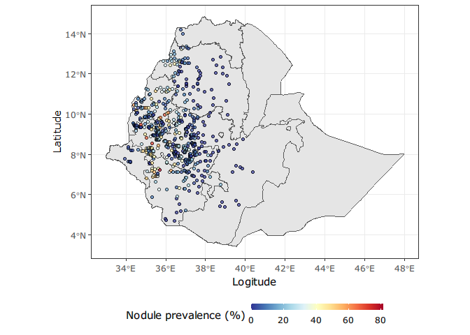
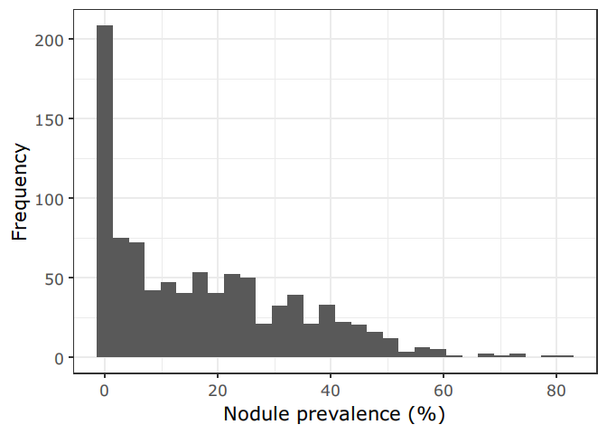
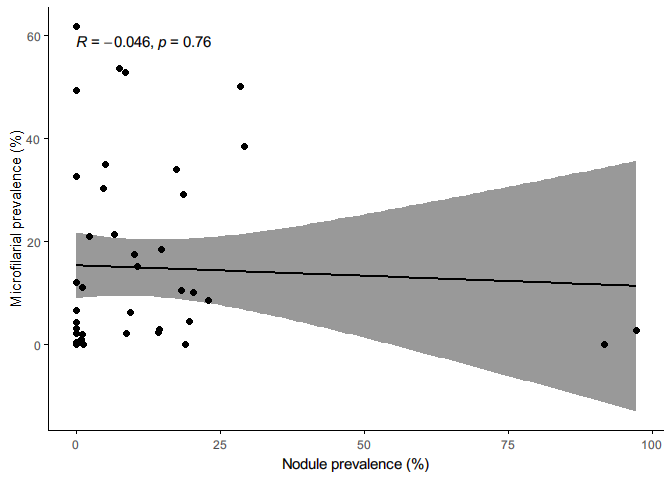
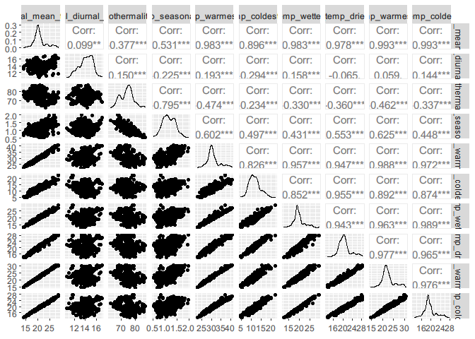
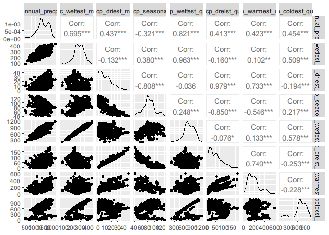
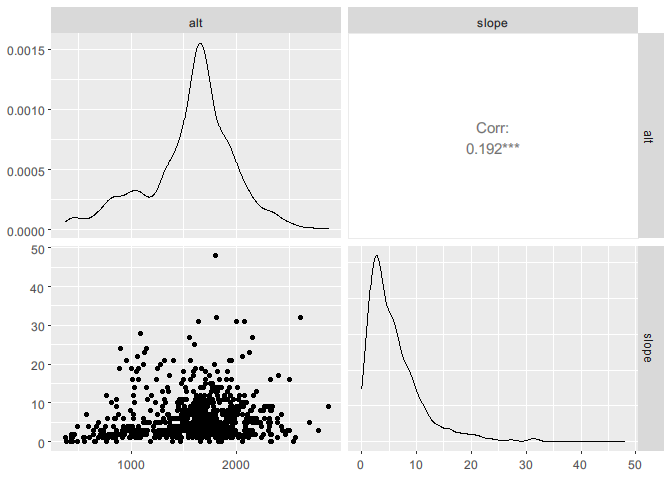
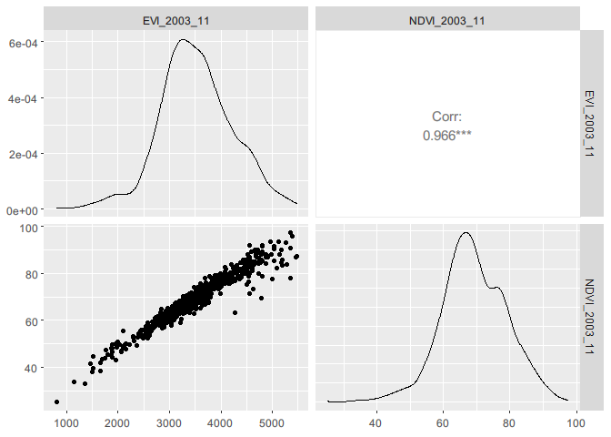
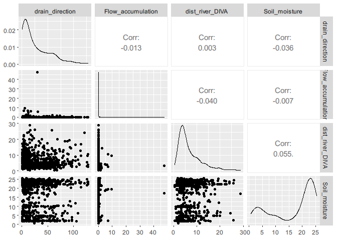
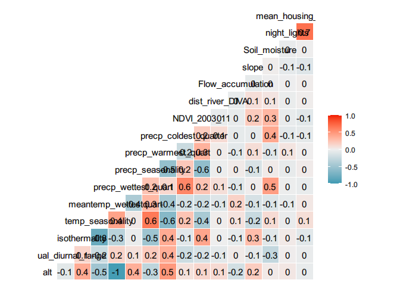
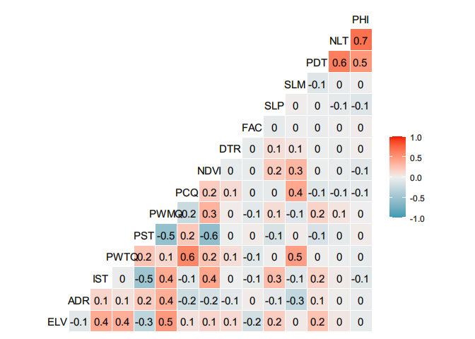

## Introduction

This script can be used for following purpose:

1.  Visualising raw prevalence data along with the map of Ethiopia

2.  Visualise environmental data

3.  Extract environmental data for each data points

4.  Explore environmental data for correlation - Round I selection of
    environmental variables

## Load libraries

``` r
extrafont::loadfonts(device = "win")
```

``` r
suppressMessages({
    library(sf)
    library(dplyr)
    library(ggplot2)
    library(rgdal)
    library(leaflet)
    library(raster)
    library(RColorBrewer)
    library(tmap)
    library(gstat)
    library(tidyr)
    library(rasterVis)
    library(cowplot)
    library(climateStability)
    library(car)
    library(GGally)
    library(data.table)
})
```

## Loading the data

``` r
# prevalence data
data <- read.csv("data/eth_espen_nodule_prev.csv")
data$prevalence <- data$CASES/data$N *100

# Ethiopia border level 0 - country level
m_0 <- getData(name = "GADM", country = "ETH", level = 0)
m_0_sf <- m_0 %>% st_as_sf()

# Ethiopia border level 1 - region level
m_1 <- getData(name = "GADM", country = "ETH", level = 1)
m_1_sf <- m_1 %>% st_as_sf()
```

## Visualize prevalence data on a map

``` r
mypalette <- colorRampPalette(rev(brewer.pal(11, "RdYlBu")))

# raw prevlaence data on a map
prev <- ggplot(m_1_sf) +
  geom_sf()+ coord_sf(datum = sf::st_crs(4326))+
  geom_point(data = data, aes(LONG, LAT, fill = prevalence), color = "black", size = 1.25, stroke = .5, shape = 21, alpha = .7)+ # plotting points with stroke
  theme_bw(base_family = "Verdana") +
  scale_fill_gradientn(colours = mypalette(100)) +
  xlab("Logitude") + ylab("Latitude") + labs(fill = "Nodule prevalence (%)") + theme(legend.position = "bottom", legend.key.size = unit(2, 'cm'),
                                                                                     #change legend key size
        legend.key.height = unit(.25, 'cm'), #change legend key height
        legend.key.width = unit(1, 'cm'))

prev
```



``` r
# prevalence histogram
prev_hist <- qplot(data$prevalence) + xlab("Nodule prevalence (%)") + ylab("Frequency") + theme_bw(base_family = "Verdana", base_size = 16)

prev_hist
```

    ## `stat_bin()` using `bins = 30`. Pick better value with `binwidth`.



## Visualise covariate rasters

``` r
load("data/selected_covs_files_1km.RData")
varlist <- c("slope", "precp_seasonality")
pred_data <- raster::aggregate(selected_covariates[[varlist]], fact = 5, fun = mean, na.rm = TRUE)
```

-   Thanks to the solution from [stack
    overflow](https://stackoverflow.com/questions/33227182/how-to-set-use-ggplot2-to-map-a-raster)

### Slope

``` r
colr <- colorRampPalette((brewer.pal(9, 'YlOrRd')))
r <- pred_data$slope
my.at <- seq(0, 40, 5)
slope <- levelplot(r, 
          margin=FALSE, xlab = NULL,
          ylab = NULL,
          main = "Slope",
          colorkey=list(
            space='bottom',                   
            labels=list(at=my.at, font=1, height = 0.1), height = 1, width = 0.8,
            axis.line=list(col='black')       
          ),    
          par.settings=list(
            axis.line=list(col='transparent') 
          ),
          scales=list(draw=FALSE),            
          col.regions=colr,                   
          at=seq(0, 40, len=101)) +           
  latticeExtra::layer(sp.polygons(m_0, lwd=1))   
```

### Precipitation seasonality

``` r
colr <- colorRampPalette((brewer.pal(9, 'PiYG')))
r <- pred_data$precp_seasonality
my.at <- seq(0, 155, 25)
prec_seas <- levelplot(r, 
          margin=FALSE, xlab = NULL,
          ylab = NULL,
          main = "Precipitation seasonality",
          colorkey=list(
            space='bottom',                   
            labels=list(at=my.at, font=1, height = 0.1), height = 1, width = 0.8,
            axis.line=list(col='black')       
          ),    
          par.settings=list(
            axis.line=list(col='transparent') 
          ),
          scales=list(draw=FALSE),            
          col.regions=colr,                   
          at=seq(0, 155, len=101)) +           
  latticeExtra::layer(sp.polygons(m_0, lwd=1))  
```

``` r
covariate_stack <- plot_grid(prec_seas, slope, labels = "AUTO", nrow = 1)
covariate_stack
```



## Extract environmental values for sample locations

``` r
covariates <- stack("data/covariates_1_km.grd")
```

``` r
# Extract the data from the raster--------------------------------------------------------
covs <- raster::extract(covariates, data[c("LONG","LAT")], na.rm = TRUE, df = TRUE)

data_c_covs <- as.data.frame(cbind(data, covs))
# data_c_covs <- na.omit(data_c_covs)
data_c_covs %>% head()
```

    ##       LONG     LAT CASES  N prevalence ID annual_mean_temp annual_diurnal_range
    ## 1 33.93330 7.76670     1 35   2.857143  1             26.9                 14.2
    ## 2 34.10291 8.31013     3 50   6.000000  2             27.4                 14.0
    ## 3 34.11670 8.38330     1 38   2.631579  3             27.4                 13.8
    ## 4 34.13330 7.65000     2 40   5.000000  4             26.4                 14.6
    ## 5 34.17625 7.63190     5 50  10.000000  5             26.4                 14.7
    ## 6 34.22855 7.61430     3 50   6.000000  6             26.3                 14.7
    ##   isothermality temp_seasonality maxtemp_warmest_mnth mintemp_coldest_mnth
    ## 1            73            1.238                 38.0                 18.7
    ## 2            71            1.440                 38.7                 19.2
    ## 3            70            1.433                 38.8                 19.1
    ## 4            74            1.151                 37.6                 17.9
    ## 5            74            1.152                 37.6                 17.8
    ## 6            73            1.154                 37.6                 17.7
    ##   temp_annual_range meantemp_wettestquart mean_temp_driestquart
    ## 1              19.3                  25.5                  27.2
    ## 2              19.5                  25.5                  28.1
    ## 3              19.7                  25.6                  28.0
    ## 4              19.7                  25.4                  26.4
    ## 5              19.8                  25.5                  26.2
    ## 6              19.9                  25.5                  26.1
    ##   meantemp_warmestquarter meantemp_coldestquart annual_precp prec_wettest_mnth
    ## 1                    28.8                  25.5         1100               210
    ## 2                    29.5                  25.5          882               182
    ## 3                    29.5                  25.6          881               179
    ## 4                    28.2                  25.3         1202               246
    ## 5                    28.2                  25.3         1227               253
    ## 6                    28.1                  25.4         1250               260
    ##   precp_driest_mnth precp_seasonality precp_wettest_quart precp_dreist_quart
    ## 1                 5                78                 570                 23
    ## 2                 1                83                 439                  8
    ## 3                 1                83                 440                  9
    ## 4                 4                77                 624                 31
    ## 5                 4                76                 637                 33
    ## 6                 4                76                 650                 35
    ##   precp_warmest_quart precp_coldest_quarter alt        slope NDVI_2003_11
    ## 1                 107                   570 424 0.0003492503     72.35217
    ## 2                  63                   439 427 0.0001461365     63.10573
    ## 3                  62                   440 434 0.0000000000     64.22768
    ## 4                 136                   510 440 0.9998537898     74.76305
    ## 5                 143                   517 436 0.0000000000     75.36539
    ## 6                 149                   524 440 1.0003514290     77.86320
    ##   EVI_2003_11 Flow_accumulation drain_direction dist_river_DIVA Soil_moisture
    ## 1    3629.718        0.01638113        6.724739        3.022490      9.456048
    ## 2    2829.557        0.01480120       15.277049        3.477306     22.698875
    ## 3    3029.147        0.01515928       44.484043        4.986246     22.698875
    ## 4    3672.088        1.64967513        7.005921        2.780758     19.158810
    ## 5    3759.288        6.27880621       17.607073        3.977116     19.158810
    ## 6    4042.166        5.55486965       31.335039        3.827865     19.158810
    ##   Population_density night_lights mean_housing_2000_15
    ## 1           1.842932            0             2.031090
    ## 2          11.115110            0             2.111785
    ## 3          11.115111            0             1.680093
    ## 4           3.686294            0             2.058382
    ## 5           3.686293            0             1.798683
    ## 6           3.686293            0             2.230331

## Initial selection of environmental variables

-   Grouping data into related variables
    1.  Temperature
    2.  Precipitation
    3.  Vegetation indices
    4.  Hydrological data
    5.  Socio-demographic data

``` r
data_c_covs[, c("N", "CASES", "LONG", "LAT", "ID")] <- NULL
temp_covariates <- c(names(data_c_covs)[2:12], "prevalence")
temp_data <- data_c_covs[, temp_covariates]

precip_covariates <- c(names(data_c_covs)[13:20], "prevalence")
precip_data <- data_c_covs[, precip_covariates]

elev_data <- data_c_covs[, c("alt", "slope", "prevalence")]
vegind_data <- data_c_covs[, c("EVI_2003_11", "NDVI_2003_11", "prevalence")]
hydro_data <- data_c_covs[, c("drain_direction", "Flow_accumulation", "dist_river_DIVA", "Soil_moisture", "prevalence")]
sociodem_data <- data_c_covs[, c("Population_density",
                          "night_lights", "mean_housing_2000_15", "prevalence")]
```

-   Custom functions

``` r
to_long <- function(data){
  data2 <- data %>% pivot_longer(-prevalence, names_to = "covariates", values_to = "values")
  return(data2)
}
```

### Temperature variables

``` r
temp_data_long <- to_long(data = temp_data)

temp_data$temp_annual_range <- NULL
model1 <- lm(prevalence ~., data = temp_data)  ## `temp_annual_range` is showing problem in the model due to multi-collinearity
vif(model1)
```

    ##        annual_mean_temp    annual_diurnal_range           isothermality 
    ##              1183.73216               179.82556                83.70445 
    ##        temp_seasonality    maxtemp_warmest_mnth    mintemp_coldest_mnth 
    ##                53.13578              1097.14057               539.32515 
    ##   meantemp_wettestquart   mean_temp_driestquart meantemp_warmestquarter 
    ##                81.50416               142.60221              1437.60465 
    ##   meantemp_coldestquart 
    ##               575.95412

``` r
alias(model1)  # use this to check which which covariates are perfectly correlated
```

    ## Model :
    ## prevalence ~ annual_mean_temp + annual_diurnal_range + isothermality + 
    ##     temp_seasonality + maxtemp_warmest_mnth + mintemp_coldest_mnth + 
    ##     meantemp_wettestquart + mean_temp_driestquart + meantemp_warmestquarter + 
    ##     meantemp_coldestquart

``` r
ggpairs(temp_data[, 1:ncol(temp_data)-1])
```


+ Based on the pairs plot except `annual_diurnal_range`,
`temp_seasonality`, `isothermality`, all others are correlated with each
other. We need to choose one covariate out of those correlated ones.
`meantemp_wettestquart` selected because of low VIF.

``` r
temp_covs_2 <- c("annual_diurnal_range", "temp_seasonality", "isothermality", 
                 "meantemp_wettestquart")
temp_data_covs2 <- data_c_covs[, c(temp_covs_2, "prevalence")]
summary(temp_model2 <- lm(prevalence~., data = temp_data_covs2))
```

    ## 
    ## Call:
    ## lm(formula = prevalence ~ ., data = temp_data_covs2)
    ## 
    ## Residuals:
    ##     Min      1Q  Median      3Q     Max 
    ## -31.255 -14.119  -3.634  11.303  66.053 
    ## 
    ## Coefficients:
    ##                       Estimate Std. Error t value Pr(>|t|)    
    ## (Intercept)           -13.6368    19.8768  -0.686  0.49285    
    ## annual_diurnal_range   -1.4152     0.4812  -2.941  0.00336 ** 
    ## temp_seasonality       -0.4504     3.7356  -0.121  0.90405    
    ## isothermality           0.4623     0.2011   2.299  0.02175 *  
    ## meantemp_wettestquart   0.8753     0.2542   3.444  0.00060 ***
    ## ---
    ## Signif. codes:  0 '***' 0.001 '**' 0.01 '*' 0.05 '.' 0.1 ' ' 1
    ## 
    ## Residual standard error: 16.15 on 912 degrees of freedom
    ## Multiple R-squared:  0.02465,    Adjusted R-squared:  0.02037 
    ## F-statistic: 5.762 on 4 and 912 DF,  p-value: 0.0001397

``` r
vif(temp_model2)
```

    ##  annual_diurnal_range      temp_seasonality         isothermality 
    ##              1.154404              3.191809              2.728934 
    ## meantemp_wettestquart 
    ##              1.342567

### Precipitation

``` r
precip_data_long <- to_long(data = precip_data)
precip_model1 <- lm(prevalence ~., data = precip_data);  # summary(precip_model1)
vif(precip_model1)
```

    ##          annual_precp     prec_wettest_mnth     precp_driest_mnth 
    ##             40.058243             32.234198             32.113022 
    ##     precp_seasonality   precp_wettest_quart    precp_dreist_quart 
    ##             13.747017             89.662670             46.548069 
    ##   precp_warmest_quart precp_coldest_quarter 
    ##              2.817277              1.999312

``` r
p <- ggpairs(precip_data[, 1:ncol(precip_data)-1])
p
```


+ Least correlated variables are: + Precipitation warmest quarter +
Precipitation coldest quarter + Annual Precipitation, Precipitation
Wettest Quarter, Precipitation Wettest Month - Precipitation Wettest
Quarter selected based on VIF + Precipitation Driest Month,
Precipitation Driest Quarter and Precipitation Seasonality -
Precipitation Seasonality selected

``` r
precip_covs_2 <- c("precp_wettest_quart", "precp_seasonality", "precp_warmest_quart", 
                 "precp_coldest_quarter")
precip_data_covs2 <- data_c_covs[, c(precip_covs_2, "prevalence")]
summary(precip_model2 <- lm(prevalence~., data = precip_data_covs2))
```

    ## 
    ## Call:
    ## lm(formula = prevalence ~ ., data = precip_data_covs2)
    ## 
    ## Residuals:
    ##     Min      1Q  Median      3Q     Max 
    ## -24.144 -12.546  -2.892   9.832  62.018 
    ## 
    ## Coefficients:
    ##                        Estimate Std. Error t value Pr(>|t|)    
    ## (Intercept)           19.111618   3.894673   4.907 1.09e-06 ***
    ## precp_wettest_quart    0.008444   0.004389   1.924   0.0547 .  
    ## precp_seasonality     -0.197416   0.039113  -5.047 5.41e-07 ***
    ## precp_warmest_quart   -0.009018   0.006582  -1.370   0.1710    
    ## precp_coldest_quarter  0.014478   0.002664   5.435 7.05e-08 ***
    ## ---
    ## Signif. codes:  0 '***' 0.001 '**' 0.01 '*' 0.05 '.' 0.1 ' ' 1
    ## 
    ## Residual standard error: 15.58 on 912 degrees of freedom
    ## Multiple R-squared:  0.09247,    Adjusted R-squared:  0.08849 
    ## F-statistic: 23.23 on 4 and 912 DF,  p-value: < 2.2e-16

``` r
vif(precip_model2)
```

    ##   precp_wettest_quart     precp_seasonality   precp_warmest_quart 
    ##              2.027261              1.729702              1.909627 
    ## precp_coldest_quarter 
    ##              1.810542

### Elevation data

``` r
elev_data_long <- to_long(data = elev_data)
elev_model1 <- lm(prevalence ~., data = elev_data);  # summary(elev_model1)
vif(elev_model1)
```

    ##      alt    slope 
    ## 1.038325 1.038325

``` r
p <- ggpairs(elev_data[, 1:ncol(elev_data)-1])
p
```


+ `alt` and `slope` selected

### Vegetation indices

``` r
vegind_data_long <- to_long(data = vegind_data)

vegind_model1 <- lm(prevalence ~., data = vegind_data);  # summary(vegind_model1)
vif(vegind_model1)
```

    ##  EVI_2003_11 NDVI_2003_11 
    ##      15.0143      15.0143

``` r
p <- ggpairs(vegind_data[, 1:ncol(vegind_data)-1])
p
```


+ The range of `EVI` does not seem to be correct. `NDVI` selected.

### Hydrological data

``` r
hydro_data_long <- to_long(data = hydro_data)
hydro_model1 <- lm(prevalence ~., data = hydro_data);  # summary(hydro_model1)
vif(hydro_model1)
```

    ##   drain_direction Flow_accumulation   dist_river_DIVA     Soil_moisture 
    ##          1.001466          1.001786          1.004672          1.004389

``` r
p <- ggpairs(hydro_data[, 1:ncol(hydro_data)-1])
p
```


+ `drain direction` not selected while all other selected.

### Sociodemographic data

``` r
sociodem_data_long <- to_long(data = sociodem_data)
sociodem_model1 <- lm(prevalence ~., data = sociodem_data);  # summary(sociodem_model1)
vif(sociodem_model1)
```

    ##   Population_density         night_lights mean_housing_2000_15 
    ##             1.671560             2.434518             1.947187

``` r
p <- ggpairs(sociodem_data[, 1:ncol(sociodem_data)-1])
p
```

    ## Warning in ggally_statistic(data = data, mapping = mapping, na.rm = na.rm, :
    ## Removed 6 rows containing missing values

    ## Warning in ggally_statistic(data = data, mapping = mapping, na.rm = na.rm, :
    ## Removed 6 rows containing missing values

    ## Warning: Removed 6 rows containing missing values (geom_point).

    ## Warning: Removed 6 rows containing missing values (geom_point).

    ## Warning: Removed 6 rows containing non-finite values (stat_density).


-   All the covariates selected.

## Selected covariates

-   Altogether 17 covariates were selected

``` r
selected_covs <- c("alt", "annual_diurnal_range", "isothermality", "temp_seasonality", "meantemp_wettestquart",
                   "precp_wettest_quart", "precp_seasonality", "precp_warmest_quart",
                   "precp_coldest_quarter", "NDVI_2003_11",
                   "dist_river_DIVA", "Flow_accumulation",
                   "slope", "Soil_moisture", "night_lights", "mean_housing_2000_15")

selected_covs_data <- data_c_covs[, c(selected_covs, "prevalence")]

selected_covs_data_long <- to_long(data = selected_covs_data)
selected_covs_model1 <- lm(prevalence ~., data = selected_covs_data);  # summary(selected_covs_model1)
vif(selected_covs_model1)
```

    ##                   alt  annual_diurnal_range         isothermality 
    ##             21.054690              2.588569              3.371200 
    ##      temp_seasonality meantemp_wettestquart   precp_wettest_quart 
    ##              5.519729             20.299146              3.180529 
    ##     precp_seasonality   precp_warmest_quart precp_coldest_quarter 
    ##              4.438392              3.380076              1.981813 
    ##          NDVI_2003_11       dist_river_DIVA     Flow_accumulation 
    ##              2.713559              1.061945              1.037837 
    ##                 slope         Soil_moisture          night_lights 
    ##              1.189613              1.556764              2.006857 
    ##  mean_housing_2000_15 
    ##              2.036551

``` r
p_corr2 <- ggcorr(selected_covs_data[, 1:ncol(selected_covs_data)-1], palette = "RdBu", label = TRUE)
p_corr2
```


+ altitude and mean temperature wettest quarter are inversely related.
Altitude selected as a variable of interest. + Isothermality and
temperature seasonality are correlated, isothermality selected based on
VIF

``` r
selected_covs <- c("alt", "annual_diurnal_range", "isothermality",
                   "precp_wettest_quart", "precp_seasonality", "precp_warmest_quart",
                   "precp_coldest_quarter", "NDVI_2003_11",
                   "dist_river_DIVA", "Flow_accumulation",
                   "slope", "Soil_moisture", "Population_density", "night_lights", "mean_housing_2000_15")
selected_covs_data <- data_c_covs[, c(selected_covs, "prevalence")]
selected_covs_model1 <- lm(prevalence ~., data = selected_covs_data); 
vif(selected_covs_model1)
```

    ##                   alt  annual_diurnal_range         isothermality 
    ##              2.622899              2.392261              2.019792 
    ##   precp_wettest_quart     precp_seasonality   precp_warmest_quart 
    ##              3.148354              3.964143              3.371920 
    ## precp_coldest_quarter          NDVI_2003_11       dist_river_DIVA 
    ##              1.871039              2.680089              1.057123 
    ##     Flow_accumulation                 slope         Soil_moisture 
    ##              1.036043              1.165568              1.549805 
    ##    Population_density          night_lights  mean_housing_2000_15 
    ##              1.931583              2.452536              2.060741

``` r
selected_covs_data_2 <- selected_covs_data %>% as.data.table()
col_names <- c("ELV","ADR", "IST", "PWTQ", "PST","PWMQ", "PCQ","NDVI","DTR","FAC","SLP","SLM","PDT", "NLT", "PHI", "PREV")
selected_covs_data_2 <- selected_covs_data_2 %>% setnames(col_names) %>% data.frame()
p_corr2 <- ggcorr(selected_covs_data_2[, 1:ncol(selected_covs_data_2)-1], palette = "RdBu", label = TRUE)
p_corr2
```


