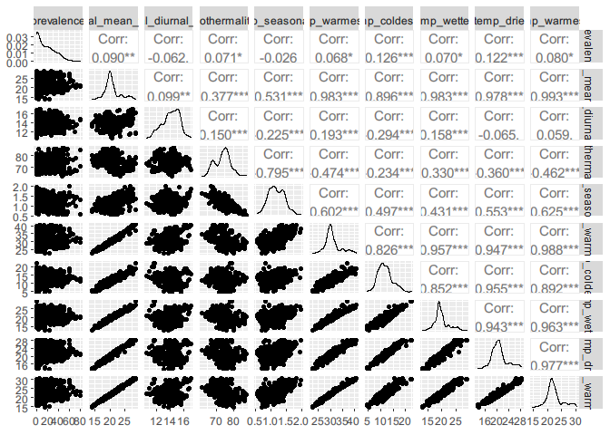

## Introduction

This script can be used for following purpose:

1.  Filtering raw prevalence data from the [ESPEN
    database](https://espen.afro.who.int/tools-resources/download-data).

2.  Visualising raw onchocerciasis nodule prevalence data along with the
    map of Ethiopia.

3.  Visualise environmental data

4.  Extracting environmental data for each data points

5.  Exploring environmental data for correlation - Round I selection of
    environmental variables

## Load libraries

``` r
extrafont::loadfonts(device = "win", quiet = T)
```

``` r
suppressMessages({
    library(sf)
    library(dplyr)
    library(ggplot2)
    library(rgdal)
    library(leaflet)
    library(raster)
    library(RColorBrewer)
    library(tmap)
    library(gstat)
    library(tidyr)
    library(rasterVis)
    library(cowplot)
    library(climateStability)
    library(car)
    library(GGally)
    library(data.table)
    library(ggpubr)
    library(ggspatial)
})
```

## Loading the data

``` r
# data from ESPEN
eth_prev_site <- read.csv("data/data-ET-oncho-sitelevel.csv")

eth_prev_site_2 <- eth_prev_site %>% dplyr::select(ADMIN1_NAME, ADMIN2_NAME,
                                                   IU_NAME, IU_ID, LocationName,
                                                   Longitude, Latitude, 
                                                   Georeliability, SurveyYear,
                                                   Period, Year_MDA1, Method_0,
                                                   Method_2,
                                                   Examined, Positive, 
                                                   Prevalence, CMFL) %>% rename(LONG = Longitude,
                                              LAT = Latitude,
                                              N = Examined,
                                              CASES = Positive)

eth_prev_mf <- eth_prev_site_2 %>% filter(Method_2 == "Parasitology (Skin biopsy)")

eth_prev_nodule <- eth_prev_site_2 %>% filter(Method_2 == "Nodule palpation")
```

-   Finding values from the same locations

``` r
find_duplicate <- function(df){
  i <- duplicated(df[, c("LONG", "LAT")])
  long_dup <- df[i, ]$LONG
  lat_dup <- df[i, ]$LAT
  duplicate_sites <- df %>% filter(LONG %in% long_dup & LAT %in% lat_dup)
  return(duplicate_sites)
}
  
duplicate_mf <- find_duplicate(df = eth_prev_mf)
duplicate_nodule <- find_duplicate(df = eth_prev_nodule)
```

-   Aggregating the observations from same locations

``` r
eth_prev_nodule_2 <- group_by(eth_prev_nodule, LONG, LAT, Method_2) %>%  summarize(
    total = sum(N),
    positive = sum(CASES),
    PREV = positive/total
  )
```

    ## `summarise()` has grouped output by 'LONG', 'LAT'. You can override using the `.groups` argument.

``` r
eth_prev_nodule_2 <- eth_prev_nodule_2 %>% rename(N = total,
                                                  CASES = positive)
eth_prev_nodule_2 %>% find_duplicate()
```

    ## # A tibble: 0 x 6
    ## # Groups:   LONG, LAT [0]
    ## # ... with 6 variables: LONG <dbl>, LAT <dbl>, Method_2 <chr>, N <int>,
    ## #   CASES <int>, PREV <dbl>

``` r
eth_prev_mf_2 <- group_by(eth_prev_mf, LONG, LAT, Method_2) %>%
  summarize(
    total = sum(N),
    positive = sum(CASES),
    PREV = positive/total
  )
```

    ## `summarise()` has grouped output by 'LONG', 'LAT'. You can override using the `.groups` argument.

``` r
eth_prev_mf_2 <- eth_prev_mf_2 %>% rename(N = total,
                                              CASES = positive)
```

-   Combining nodule data with unique coordinates: `eth_prev_nodule_2`,
    and skin mf data `eth_prev_mf_2` with unique coordinates

``` r
col_required <- names(eth_prev_mf_2)
eth_prev_nodule_2 <- eth_prev_nodule_2[, dput(as.character(names(eth_prev_mf_2)))]
```

    ## c("LONG", "LAT", "Method_2", "N", "CASES", "PREV")

``` r
eth_prevalence <- bind_rows(eth_prev_mf_2, eth_prev_nodule_2)
eth_prevalence <- eth_prevalence %>% dplyr::select(LONG, LAT, PREV, Method_2)

eth_prev_same_site <- find_duplicate(df = eth_prevalence)
eth_prev_ss_wide <- eth_prev_same_site %>% pivot_wider(names_from = Method_2,
                                                       values_from = PREV)
```

-   \_Correlation analysis\_\_: REMO and skin mf data from the same
    geographic coordinates were selected for the correlation analysis.

``` r
cor.test(eth_prev_ss_wide$`Parasitology (Skin biopsy)`, eth_prev_ss_wide$`Nodule palpation`, method = "pearson")
```

    ## 
    ##  Pearson's product-moment correlation
    ## 
    ## data:  eth_prev_ss_wide$`Parasitology (Skin biopsy)` and eth_prev_ss_wide$`Nodule palpation`
    ## t = -0.30107, df = 42, p-value = 0.7648
    ## alternative hypothesis: true correlation is not equal to 0
    ## 95 percent confidence interval:
    ##  -0.3386209  0.2539737
    ## sample estimates:
    ##        cor 
    ## -0.0464057

``` r
eth_prev_ss_wide$`Parasitology (Skin biopsy)` <- eth_prev_ss_wide$`Parasitology (Skin biopsy)` * 100
eth_prev_ss_wide$`Nodule palpation` <- eth_prev_ss_wide$`Nodule palpation` * 100

cor_plot <- ggscatter(eth_prev_ss_wide, y = "Parasitology (Skin biopsy)", 
          x = "Nodule palpation", 
          add = "reg.line", conf.int = TRUE, 
          cor.coef = TRUE, cor.method = "pearson",
          ylab = "Microfilarial prevalence (%)", xlab = "Nodule prevalence (%)",
          ggtheme = theme_classic(base_family = "Arial"))
cor_plot
```

    ## `geom_smooth()` using formula 'y ~ x'


-   There are two observations which has very high REMO prevalence
    (>90%) but near to zero mf prevalence. This could be the result of
    fluctuation in vector dynamics, or human error. These two data were
    deemed as outliers and not included for the analysis.
-   Removing outliers

``` r
eth_prev_ss_wide <- eth_prev_ss_wide %>% rename(REMO = "Nodule palpation") 
filter(eth_prev_ss_wide, REMO > 90) -> outlier_obs
outlier_site <- eth_prev_site[eth_prev_site$Longitude %in% outlier_obs$LONG, ]
remove_outlier <- setdiff(eth_prev_ss_wide, outlier_obs)
eth_prev_nodule_3 <- eth_prev_nodule_2[!eth_prev_nodule_2$LONG %in% outlier_obs$LONG, ] %>% mutate(Method_2 = NULL)
```

-   `eth_prev_nodule_3` is the dataset used for the prevalence mapping.

``` r
# prevalence data
data <- eth_prev_nodule_3
data$prevalence <- data$PREV *100

# Ethiopia border level 0 - country level
m_0 <- getData(name = "GADM", country = "ETH", level = 0)
m_0_sf <- m_0 %>% st_as_sf()

# Ethiopia border level 1 - region level
m_1 <- getData(name = "GADM", country = "ETH", level = 1)
m_1_sf <- m_1 %>% st_as_sf()
```

## Visualize prevalence data on a map

``` r
mypalette <- colorRampPalette(rev(brewer.pal(11, "RdYlBu")))

# raw prevlaence data on a map
prev <- ggplot() +
  geom_sf(data = m_1_sf, col = "black", lwd = 0.8, lty = 1, alpha = 0) +
  geom_sf(data = m_0_sf, col = "black", lwd = 1, lty = 1, alpha = 0) +
  coord_sf(datum = sf::st_crs(4326))+
  geom_point(data = data, aes(LONG, LAT, fill = prevalence), color = "black", size = 2, stroke = .5, shape = 21, alpha = .7)+ # plotting points with stroke
  theme_void(base_family = "Arial") +
  scale_fill_gradientn(colours = mypalette(100)) +
  xlab("Logitude") + ylab("Latitude") + labs(fill = "Nodule prevalence (%)") + theme(legend.position = "bottom", legend.key.size = unit(2, 'cm'),
                                                                                     #change legend key size
        legend.key.height = unit(.25, 'cm'), #change legend key height
        legend.key.width = unit(1, 'cm')) +
  theme(legend.position = "bottom", legend.key.size = unit(2, 'cm'), #change legend key size
        legend.key.height = unit(.5, 'cm'), #change legend key height
        legend.key.width = unit(1.5, 'cm')) +
  guides(fill = guide_colourbar(title.position="top", title.hjust = 0.5)) +  
  annotation_scale(location = "br", width_hint = 0.5) + #change legend key size 
  annotation_north_arrow(location = "tl", which_north = "true",
                       pad_x = unit(0.15, "in"), pad_y = unit(0.25, "in"),
                       style = north_arrow_fancy_orienteering)
prev
```


``` r
# prevalence histogram
hist(data$prevalence, main = "",
     xlab="Nodule prevalence (%)", ylab = ("Frequency"),
     border="black", 
     col="darkgrey",
     las=1, 
     breaks=30)
```


## Visualise covariate rasters

``` r
load("data/selected_covs_files_1km.RData")
varlist <- c("slope", "precp_seasonality")
pred_data <- raster::aggregate(selected_covariates[[varlist]], fact = 5, fun = mean, na.rm = TRUE)
```

-   Thanks to the solution from [stack
    overflow](https://stackoverflow.com/questions/33227182/how-to-set-use-ggplot2-to-map-a-raster)

### Slope

``` r
colr <- colorRampPalette((brewer.pal(9, 'YlOrRd')))
r <- pred_data$slope
my.at <- seq(0, 40, 5)
slope <- levelplot(r, 
          margin=FALSE, xlab = NULL,
          ylab = NULL,
          main = "Slope",
          colorkey=list(
            space='bottom',                   
            labels=list(at=my.at, font=1, height = 0.1), height = 1, width = 0.8,
            axis.line=list(col='black')       
          ),    
          par.settings=list(
            axis.line=list(col='transparent') 
          ),
          scales=list(draw=FALSE),            
          col.regions=colr,                   
          at=seq(0, 40, len=101)) +           
  latticeExtra::layer(sp.polygons(m_0, lwd=1))   
```

### Precipitation seasonality

``` r
colr <- colorRampPalette((brewer.pal(9, 'PiYG')))
r <- pred_data$precp_seasonality
my.at <- seq(0, 155, 25)
prec_seas <- levelplot(r, 
          margin=FALSE, xlab = NULL,
          ylab = NULL,
          main = "Precipitation seasonality",
          colorkey=list(
            space='bottom',                   
            labels=list(at=my.at, font=1, height = 0.1), height = 1, width = 0.8,
            axis.line=list(col='black')       
          ),    
          par.settings=list(
            axis.line=list(col='transparent') 
          ),
          scales=list(draw=FALSE),            
          col.regions=colr,                   
          at=seq(0, 155, len=101)) +           
  latticeExtra::layer(sp.polygons(m_0, lwd=1))  
```

``` r
covariate_stack <- plot_grid(prec_seas, slope, labels = "AUTO", nrow = 1)
covariate_stack
```


## Extract environmental values for sample locations

``` r
covariates <- stack("data/covariates_1_km.grd")
```

``` r
# Extract the data from the raster--------------------------------------------------------
covs <- raster::extract(covariates, data[c("LONG","LAT")], na.rm = TRUE, df = TRUE)

data_c_covs <- as.data.frame(cbind(data, covs))
# data_c_covs <- na.omit(data_c_covs)
data_c_covs %>% head()
```

    ##       LONG     LAT  N CASES       PREV prevalence ID annual_mean_temp
    ## 1 33.93330 7.76670 35     1 0.02857143   2.857143  1             26.9
    ## 2 34.10291 8.31013 50     3 0.06000000   6.000000  2             27.4
    ## 3 34.11670 8.38330 38     1 0.02631579   2.631579  3             27.4
    ## 4 34.13330 7.65000 40     2 0.05000000   5.000000  4             26.4
    ## 5 34.17625 7.63190 50     5 0.10000000  10.000000  5             26.4
    ## 6 34.22855 7.61430 50     3 0.06000000   6.000000  6             26.3
    ##   annual_diurnal_range isothermality temp_seasonality maxtemp_warmest_mnth
    ## 1                 14.2            73            1.238                 38.0
    ## 2                 14.0            71            1.440                 38.7
    ## 3                 13.8            70            1.433                 38.8
    ## 4                 14.6            74            1.151                 37.6
    ## 5                 14.7            74            1.152                 37.6
    ## 6                 14.7            73            1.154                 37.6
    ##   mintemp_coldest_mnth temp_annual_range meantemp_wettestquart
    ## 1                 18.7              19.3                  25.5
    ## 2                 19.2              19.5                  25.5
    ## 3                 19.1              19.7                  25.6
    ## 4                 17.9              19.7                  25.4
    ## 5                 17.8              19.8                  25.5
    ## 6                 17.7              19.9                  25.5
    ##   mean_temp_driestquart meantemp_warmestquarter meantemp_coldestquart
    ## 1                  27.2                    28.8                  25.5
    ## 2                  28.1                    29.5                  25.5
    ## 3                  28.0                    29.5                  25.6
    ## 4                  26.4                    28.2                  25.3
    ## 5                  26.2                    28.2                  25.3
    ## 6                  26.1                    28.1                  25.4
    ##   annual_precp prec_wettest_mnth precp_driest_mnth precp_seasonality
    ## 1         1100               210                 5                78
    ## 2          882               182                 1                83
    ## 3          881               179                 1                83
    ## 4         1202               246                 4                77
    ## 5         1227               253                 4                76
    ## 6         1250               260                 4                76
    ##   precp_wettest_quart precp_dreist_quart precp_warmest_quart
    ## 1                 570                 23                 107
    ## 2                 439                  8                  63
    ## 3                 440                  9                  62
    ## 4                 624                 31                 136
    ## 5                 637                 33                 143
    ## 6                 650                 35                 149
    ##   precp_coldest_quarter alt        slope NDVI_2003_11 EVI_2003_11
    ## 1                   570 424 0.0003492503     72.35217    3629.718
    ## 2                   439 427 0.0001461365     63.10573    2829.557
    ## 3                   440 434 0.0000000000     64.22768    3029.147
    ## 4                   510 440 0.9998537898     74.76305    3672.088
    ## 5                   517 436 0.0000000000     75.36539    3759.288
    ## 6                   524 440 1.0003514290     77.86320    4042.166
    ##   Flow_accumulation drain_direction dist_river_DIVA Soil_moisture
    ## 1        0.01638113        6.724739        3.022490      9.456048
    ## 2        0.01480120       15.277049        3.477306     22.698875
    ## 3        0.01515928       44.484043        4.986246     22.698875
    ## 4        1.64967513        7.005921        2.780758     19.158810
    ## 5        6.27880621       17.607073        3.977116     19.158810
    ## 6        5.55486965       31.335039        3.827865     19.158810
    ##   Population_density night_lights mean_housing_2000_15
    ## 1           1.842932            0             2.031090
    ## 2          11.115110            0             2.111785
    ## 3          11.115111            0             1.680093
    ## 4           3.686294            0             2.058382
    ## 5           3.686293            0             1.798683
    ## 6           3.686293            0             2.230331

## Initial selection of environmental variables

-   Grouping data into related variables
    1.  Temperature
    2.  Precipitation
    3.  Vegetation indices
    4.  Hydrological data
    5.  Socio-demographic data

``` r
data_c_covs[, c("N", "CASES", "LONG", "LAT", "ID")] <- NULL
temp_covariates <- c(names(data_c_covs)[2:12], "prevalence")
temp_data <- data_c_covs[, temp_covariates]

precip_covariates <- c(names(data_c_covs)[13:20], "prevalence")
precip_data <- data_c_covs[, precip_covariates]

elev_data <- data_c_covs[, c("alt", "slope", "prevalence")]
vegind_data <- data_c_covs[, c("EVI_2003_11", "NDVI_2003_11", "prevalence")]
hydro_data <- data_c_covs[, c("drain_direction", "Flow_accumulation", "dist_river_DIVA", "Soil_moisture", "prevalence")]
sociodem_data <- data_c_covs[, c("Population_density",
                          "night_lights", "mean_housing_2000_15", "prevalence")]
```

-   Custom functions

``` r
to_long <- function(data){
  data2 <- data %>% pivot_longer(-prevalence, names_to = "covariates", values_to = "values")
  return(data2)
}
```

### Temperature variables

``` r
temp_data_long <- to_long(data = temp_data)

temp_data$temp_annual_range <- NULL
model1 <- lm(prevalence ~., data = temp_data)  ## `temp_annual_range` is showing problem in the model due to multi-collinearity
vif(model1)
```

    ##        annual_mean_temp    annual_diurnal_range           isothermality 
    ##             1140.532969              184.505038               88.751881 
    ##        temp_seasonality    maxtemp_warmest_mnth    mintemp_coldest_mnth 
    ##               19.016005             1105.425144              545.897332 
    ##   meantemp_wettestquart   mean_temp_driestquart meantemp_warmestquarter 
    ##               80.228320              141.556530             1133.328386 
    ##            prevalence.1 
    ##                1.159626

``` r
alias(model1)  # use this to check which which covariates are perfectly correlated
```

    ## Model :
    ## prevalence ~ annual_mean_temp + annual_diurnal_range + isothermality + 
    ##     temp_seasonality + maxtemp_warmest_mnth + mintemp_coldest_mnth + 
    ##     meantemp_wettestquart + mean_temp_driestquart + meantemp_warmestquarter + 
    ##     prevalence.1

``` r
ggpairs(temp_data[, 1:ncol(temp_data)-1])
```


+ Based on the pairs plot except `annual_diurnal_range`,
`temp_seasonality`, `isothermality`, all others are correlated with each
other. We need to choose one covariate out of those correlated ones.
`meantemp_wettestquart` selected because of low VIF.

``` r
temp_covs_2 <- c("annual_diurnal_range", "temp_seasonality", "isothermality", 
                 "meantemp_wettestquart")
temp_data_covs2 <- data_c_covs[, c(temp_covs_2, "prevalence")]
summary(temp_model2 <- lm(prevalence~., data = temp_data_covs2))
```

    ## 
    ## Call:
    ## lm(formula = prevalence ~ ., data = temp_data_covs2)
    ## 
    ## Residuals:
    ##     Min      1Q  Median      3Q     Max 
    ## -31.255 -14.119  -3.634  11.303  66.053 
    ## 
    ## Coefficients:
    ##                       Estimate Std. Error t value Pr(>|t|)    
    ## (Intercept)           -13.6368    19.8768  -0.686  0.49285    
    ## annual_diurnal_range   -1.4152     0.4812  -2.941  0.00336 ** 
    ## temp_seasonality       -0.4504     3.7356  -0.121  0.90405    
    ## isothermality           0.4623     0.2011   2.299  0.02175 *  
    ## meantemp_wettestquart   0.8753     0.2542   3.444  0.00060 ***
    ## ---
    ## Signif. codes:  0 '***' 0.001 '**' 0.01 '*' 0.05 '.' 0.1 ' ' 1
    ## 
    ## Residual standard error: 16.15 on 912 degrees of freedom
    ## Multiple R-squared:  0.02465,    Adjusted R-squared:  0.02037 
    ## F-statistic: 5.762 on 4 and 912 DF,  p-value: 0.0001397

``` r
vif(temp_model2)
```

    ##  annual_diurnal_range      temp_seasonality         isothermality 
    ##              1.154404              3.191809              2.728934 
    ## meantemp_wettestquart 
    ##              1.342567

### Precipitation

``` r
precip_data_long <- to_long(data = precip_data)
precip_model1 <- lm(prevalence ~., data = precip_data);  # summary(precip_model1)
vif(precip_model1)
```

    ## meantemp_coldestquart          annual_precp     prec_wettest_mnth 
    ##              1.662185             39.974747             33.446550 
    ##     precp_driest_mnth     precp_seasonality   precp_wettest_quart 
    ##             30.954151             13.961409             89.656484 
    ##    precp_dreist_quart   precp_warmest_quart 
    ##             44.206424              2.774856

``` r
p <- ggpairs(precip_data[, 1:ncol(precip_data)-1])
p
```


+ Least correlated variables are: + Precipitation warmest quarter +
Precipitation coldest quarter + Annual Precipitation, Precipitation
Wettest Quarter, Precipitation Wettest Month - Precipitation Wettest
Quarter selected based on VIF + Precipitation Driest Month,
Precipitation Driest Quarter and Precipitation Seasonality -
Precipitation Seasonality selected

``` r
precip_covs_2 <- c("precp_wettest_quart", "precp_seasonality", "precp_warmest_quart", 
                 "precp_coldest_quarter")
precip_data_covs2 <- data_c_covs[, c(precip_covs_2, "prevalence")]
summary(precip_model2 <- lm(prevalence~., data = precip_data_covs2))
```

    ## 
    ## Call:
    ## lm(formula = prevalence ~ ., data = precip_data_covs2)
    ## 
    ## Residuals:
    ##     Min      1Q  Median      3Q     Max 
    ## -24.144 -12.546  -2.892   9.832  62.018 
    ## 
    ## Coefficients:
    ##                        Estimate Std. Error t value Pr(>|t|)    
    ## (Intercept)           19.111618   3.894673   4.907 1.09e-06 ***
    ## precp_wettest_quart    0.008444   0.004389   1.924   0.0547 .  
    ## precp_seasonality     -0.197416   0.039113  -5.047 5.41e-07 ***
    ## precp_warmest_quart   -0.009018   0.006582  -1.370   0.1710    
    ## precp_coldest_quarter  0.014478   0.002664   5.435 7.05e-08 ***
    ## ---
    ## Signif. codes:  0 '***' 0.001 '**' 0.01 '*' 0.05 '.' 0.1 ' ' 1
    ## 
    ## Residual standard error: 15.58 on 912 degrees of freedom
    ## Multiple R-squared:  0.09247,    Adjusted R-squared:  0.08849 
    ## F-statistic: 23.23 on 4 and 912 DF,  p-value: < 2.2e-16

``` r
vif(precip_model2)
```

    ##   precp_wettest_quart     precp_seasonality   precp_warmest_quart 
    ##              2.027261              1.729702              1.909627 
    ## precp_coldest_quarter 
    ##              1.810542

### Elevation data

``` r
elev_data_long <- to_long(data = elev_data)
elev_model1 <- lm(prevalence ~., data = elev_data);  # summary(elev_model1)
vif(elev_model1)
```

    ##      alt    slope 
    ## 1.038325 1.038325

``` r
p <- ggpairs(elev_data[, 1:ncol(elev_data)-1])
p
```


+ `alt` and `slope` selected

### Vegetation indices

``` r
vegind_data_long <- to_long(data = vegind_data)

vegind_model1 <- lm(prevalence ~., data = vegind_data);  # summary(vegind_model1)
vif(vegind_model1)
```

    ##  EVI_2003_11 NDVI_2003_11 
    ##      15.0143      15.0143

``` r
p <- ggpairs(vegind_data[, 1:ncol(vegind_data)-1])
p
```


+ The range of `EVI` does not seem to be correct. `NDVI` selected.

### Hydrological data

``` r
hydro_data_long <- to_long(data = hydro_data)
hydro_model1 <- lm(prevalence ~., data = hydro_data);  # summary(hydro_model1)
vif(hydro_model1)
```

    ##   drain_direction Flow_accumulation   dist_river_DIVA     Soil_moisture 
    ##          1.001466          1.001786          1.004672          1.004389

``` r
p <- ggpairs(hydro_data[, 1:ncol(hydro_data)-1])
p
```


+ `drain direction` not selected while all other selected.

### Sociodemographic data

``` r
sociodem_data_long <- to_long(data = sociodem_data)
sociodem_model1 <- lm(prevalence ~., data = sociodem_data);  # summary(sociodem_model1)
vif(sociodem_model1)
```

    ##   Population_density         night_lights mean_housing_2000_15 
    ##             1.671560             2.434518             1.947187

``` r
p <- ggpairs(sociodem_data[, 1:ncol(sociodem_data)-1])
p
```


-   All the covariates selected.

## Selected covariates

-   Altogether 17 covariates were selected

``` r
selected_covs <- c("alt", "annual_diurnal_range", "isothermality", "temp_seasonality", "meantemp_wettestquart",
                   "precp_wettest_quart", "precp_seasonality", "precp_warmest_quart",
                   "precp_coldest_quarter", "NDVI_2003_11",
                   "dist_river_DIVA", "Flow_accumulation",
                   "slope", "Soil_moisture", "night_lights", "mean_housing_2000_15")

selected_covs_data <- data_c_covs[, c(selected_covs, "prevalence")]

selected_covs_data_long <- to_long(data = selected_covs_data)
selected_covs_model1 <- lm(prevalence ~., data = selected_covs_data);  # summary(selected_covs_model1)
vif(selected_covs_model1)
```

    ##                   alt  annual_diurnal_range         isothermality 
    ##             21.054690              2.588569              3.371200 
    ##      temp_seasonality meantemp_wettestquart   precp_wettest_quart 
    ##              5.519729             20.299146              3.180529 
    ##     precp_seasonality   precp_warmest_quart precp_coldest_quarter 
    ##              4.438392              3.380076              1.981813 
    ##          NDVI_2003_11       dist_river_DIVA     Flow_accumulation 
    ##              2.713559              1.061945              1.037837 
    ##                 slope         Soil_moisture          night_lights 
    ##              1.189613              1.556764              2.006857 
    ##  mean_housing_2000_15 
    ##              2.036551

``` r
p_corr2 <- ggcorr(selected_covs_data[, 1:ncol(selected_covs_data)-1], palette = "RdBu", label = TRUE)
p_corr2
```


+ altitude and mean temperature wettest quarter are inversely related.
Altitude selected as a variable of interest. + Isothermality and
temperature seasonality are correlated, isothermality selected based on
VIF

``` r
selected_covs <- c("alt", "annual_diurnal_range", "isothermality",
                   "precp_wettest_quart", "precp_seasonality", "precp_warmest_quart",
                   "precp_coldest_quarter", "NDVI_2003_11",
                   "dist_river_DIVA", "Flow_accumulation",
                   "slope", "Soil_moisture", "Population_density", "night_lights", "mean_housing_2000_15")
selected_covs_data <- data_c_covs[, c(selected_covs, "prevalence")]
selected_covs_model1 <- lm(prevalence ~., data = selected_covs_data); 
vif(selected_covs_model1)
```

    ##                   alt  annual_diurnal_range         isothermality 
    ##              2.622899              2.392261              2.019792 
    ##   precp_wettest_quart     precp_seasonality   precp_warmest_quart 
    ##              3.148354              3.964143              3.371920 
    ## precp_coldest_quarter          NDVI_2003_11       dist_river_DIVA 
    ##              1.871039              2.680089              1.057123 
    ##     Flow_accumulation                 slope         Soil_moisture 
    ##              1.036043              1.165568              1.549805 
    ##    Population_density          night_lights  mean_housing_2000_15 
    ##              1.931583              2.452536              2.060741

``` r
selected_covs_data_2 <- selected_covs_data %>% as.data.table()
col_names <- c("ELV","ADR", "IST", "PWTQ", "PST","PWMQ", "PCQ","NDVI","DTR","FAC","SLP","SLM","PDT", "NLT", "PHI", "PREV")
selected_covs_data_2 <- selected_covs_data_2 %>% setnames(col_names) %>% data.frame()
p_corr2 <- ggcorr(selected_covs_data_2[, 1:ncol(selected_covs_data_2)-1], palette = "RdBu", label = TRUE, name = "Pearson correlation", legend.position = "left", legend.size = "12")
p_corr2 <- p_corr2 + theme(legend.title = element_text(face = "bold"), legend.justification = c(1, 0),
        legend.position = c(0.3, 0.5)) + guides(fill = guide_colorbar(title.position = "top", title.hjust = 0.5))
p_corr2
```


