## Introduction

This script can be used for following purpose:

1.  Running the best model using INLA

2.  Prediction using the model to create predicted prevalence map across
    Ethiopia

3.  Creating uncertainty bivariate map

4.  Creating exceedance probability map

5.  Aggregated map based on health districts: mean prevalence, range,
    case numbers.

6.  Relationship profile between environmental variables and the
    predicted prevalence

7.  Running the regular binomial model

## Load libraries

``` r
extrafont::loadfonts(device = "win", quiet = TRUE)
```

``` r
suppressMessages({
    library(tidyverse)
    library(INLA)
    library(INLAutils)
    library(raster)
    library(sf)
    library(dplyr)
    library(tictoc)
    library(leaflet)
    library(GGally)
    library(devtools)
    library(sp)
    library(cowplot)
    library(tmap)
    library(RColorBrewer)
    library(patchwork)
    ## for bivariate maps
    library(classInt)
    library(rgdal)
    library(dismo)
    library(XML)
    library(maps)
    library(sp)
    library(ggspatial)
})
```

-   custom function for stacking the data

``` r
# data = data from sample locations includes prevalence data as CASES and N, and includes the values for environmental variables in the sample locations
# dp = data for the locations to be predicted. It includes all the environmental data for the locations where the prevalence data is to be predicted. The CASES and N column for dp is blank as these data are the ones to be predicted
# cov_list = vector of selected covariates for the model fitting and prediction
stack_data <- function(data, dp, cov_list){
  # stack for estimation stk.e
  df <- data.frame(Intercept = 1, subset(data, select = cov_list))
  stk.e <- inla.stack(
    tag = "est",
    data = list(y = data$CASES, numtrials = data$N),
    A = list(1, Ae),
    effects = list(df, spatial.field = iset)
  )
  
  # stack for prediction stk.p
  df_p <- data.frame(Intercept = 1, subset(dp, select = cov_list))
  stk.p <- inla.stack(
    tag = "pred",
    data = list(y = NA, numtrials = NA),
    A = list(1, Ap),
    effects = list(df_p, spatial.field = iset))
  
  # stk.full has stk.e and stk.p
  stk.full <- inla.stack(stk.e, stk.p)
  
  return(stk.full)
}
```

## Loading the data

``` r
load("data/selected_covs_files_1km.RData")
data <- eth_prev2

m <- getData(name = "GADM", country = "ETH", level = 0)
m_0 <- m %>% st_as_sf()
# pred_data <- selected_covariates
# ra <- pred_data

covariates <- selected_covariates
varlist <- c("slope", "isothermality", "precp_seasonality",
             "NDVI_2003_11", "dist_river_DIVA", "Population_density",
             "Flow_accumulation", "Soil_moisture") 
pred_data <- covariates[[varlist]]
pred_data <- aggregate(covariates[[varlist]], fact = 5, fun = mean, na.rm = TRUE) ## aggregating the prediction grid to 5 x 5 km grid

ra <- pred_data
dp <- data.frame(rasterToPoints(ra))
```

## Model fitting

### Mesh construction

``` r
coords <-  cbind(data$LONG, data$LAT)
bdry <- inla.sp2segment(m)
bdry$loc <- inla.mesh.map(bdry$loc)
mesh1 <- inla.mesh.2d(
  loc = coords, boundary = bdry, max.edge = c(0.5, 5),
  cutoff = 0.03 # best mesh
)
mesh1$n
```

    ## [1] 3931

``` r
spde <- inla.spde2.matern(mesh1, alpha=2)
iset <- inla.spde.make.index(name = "spatial.field", spde$n.spde)
length(iset)
```

    ## [1] 3

### Make projection matrix

``` r
Ae <- inla.spde.make.A(mesh=mesh1,loc=as.matrix(coords));dim(Ae)
```

    ## [1]  917 3931

``` r
coop <- cbind(dp$x, dp$y)
Ap <- inla.spde.make.A(mesh = mesh1, loc = coop);dim(Ap)
```

    ## [1] 54160  3931

### Model formula

``` r
predterms <- as.formula(paste("y ~ 0 + Intercept +", paste(varlist, collapse =  "+"), "+ f(spatial.field, model = spde)"))
datastack <- stack_data(data = data, dp = dp, cov_list = varlist)
```

### Model fitting

``` r
tic()
res <- inla(predterms,
            family = "zeroinflated.binomial.1", Ntrials = numtrials,
            data = inla.stack.data(datastack, spde = spde),
            control.family = list(link = "logit"),
            control.compute = list(dic = TRUE, waic = TRUE,
                                   cpo = TRUE, config = TRUE,
                                   openmp.strategy="huge"),
            control.predictor = list(
              compute = TRUE, link = 1,
              A = inla.stack.A(datastack)
            )
)
toc()
```

### Model results

``` r
res <- readRDS("data/inla_point_res_5km_mesh5.rds")
summary(res)
```

    ## 
    ## Call:
    ##    c("inla(formula = predterms, family = \"zeroinflated.binomial.1\", ", " 
    ##    data = inla.stack.data(datastack, spde = spde), Ntrials = numtrials, ", 
    ##    " control.compute = list(dic = TRUE, waic = TRUE, cpo = TRUE, ", " 
    ##    config = TRUE, openmp.strategy = \"huge\"), control.predictor = 
    ##    list(compute = TRUE, ", " link = 1, A = inla.stack.A(datastack)), 
    ##    control.family = list(link = \"logit\"))" ) 
    ## Time used:
    ##     Pre = 0.789, Running = 1166, Post = 7.49, Total = 1174 
    ## Fixed effects:
    ##                      mean    sd 0.025quant 0.5quant 0.975quant   mode kld
    ## b0                 -1.940 1.520     -4.923   -1.941      1.042 -1.941   0
    ## slope               0.001 0.004     -0.007    0.001      0.009  0.001   0
    ## isothermality      -0.002 0.014     -0.029   -0.002      0.025 -0.002   0
    ## precp_seasonality  -0.016 0.008     -0.032   -0.016      0.000 -0.016   0
    ## NDVI_2003_11        0.002 0.004     -0.007    0.002      0.010  0.002   0
    ## dist_river_DIVA    -0.015 0.005     -0.025   -0.015     -0.005 -0.015   0
    ## Flow_accumulation  -0.042 0.013     -0.070   -0.041     -0.019 -0.040   0
    ## Soil_moisture       0.022 0.004      0.013    0.022      0.030  0.022   0
    ## Population_density  0.000 0.000      0.000    0.000      0.000  0.000   0
    ## 
    ## Random effects:
    ##   Name     Model
    ##     spatial.field SPDE2 model
    ## 
    ## Model hyperparameters:
    ##                                                           mean    sd 0.025quant
    ## zero-probability parameter for zero-inflated binomial_1  0.333 0.004      0.327
    ## Theta1 for spatial.field                                -1.340 0.034     -1.417
    ## Theta2 for spatial.field                                -0.096 0.032     -0.170
    ##                                                         0.5quant 0.975quant
    ## zero-probability parameter for zero-inflated binomial_1    0.333      0.342
    ## Theta1 for spatial.field                                  -1.335     -1.286
    ## Theta2 for spatial.field                                  -0.092     -0.046
    ##                                                           mode
    ## zero-probability parameter for zero-inflated binomial_1  0.331
    ## Theta1 for spatial.field                                -1.317
    ## Theta2 for spatial.field                                -0.074
    ## 
    ## Expected number of effective parameters(stdev): 122.76(0.469)
    ## Number of equivalent replicates : 7.47 
    ## 
    ## Deviance Information Criterion (DIC) ...............: 5331.94
    ## Deviance Information Criterion (DIC, saturated) ....: NaN
    ## Effective number of parameters .....................: 135.87
    ## 
    ## Watanabe-Akaike information criterion (WAIC) ...: 5560.34
    ## Effective number of parameters .................: 305.73
    ## 
    ## Marginal log-Likelihood:  -2935.39 
    ## CPO and PIT are computed
    ## 
    ## Posterior marginals for the linear predictor and
    ##  the fitted values are computed

``` r
reg_coff <- res$summary.fixed %>% arrange(desc(mean))

### Fixed effects from the model
reg_coff %>% round(digits = 5)
```

    ##                        mean      sd 0.025quant 0.5quant 0.975quant     mode kld
    ## Soil_moisture       0.02158 0.00415    0.01345  0.02158    0.02973  0.02157   0
    ## NDVI_2003_11        0.00168 0.00449   -0.00715  0.00168    0.01049  0.00169   0
    ## slope               0.00097 0.00410   -0.00711  0.00098    0.00899  0.00099   0
    ## Population_density  0.00005 0.00015   -0.00025  0.00005    0.00034  0.00005   0
    ## isothermality      -0.00185 0.01365   -0.02866 -0.00184    0.02492 -0.00184   0
    ## dist_river_DIVA    -0.01508 0.00514   -0.02519 -0.01507   -0.00500 -0.01506   0
    ## precp_seasonality  -0.01645 0.00814   -0.03243 -0.01645   -0.00049 -0.01645   0
    ## Flow_accumulation  -0.04225 0.01316   -0.07029 -0.04146   -0.01855 -0.03985   0
    ## b0                 -1.94027 1.51964   -4.92325 -1.94057    1.04164 -1.94103   0

``` r
### Hyper parameters from the model
res$summary.hyperpar %>% data.frame() %>% round(digits = 5)
```

    ##                                                             mean      sd
    ## zero-probability parameter for zero-inflated binomial_1  0.33345 0.00384
    ## Theta1 for spatial.field                                -1.33992 0.03403
    ## Theta2 for spatial.field                                -0.09636 0.03231
    ##                                                         X0.025quant X0.5quant
    ## zero-probability parameter for zero-inflated binomial_1     0.32748   0.33290
    ## Theta1 for spatial.field                                   -1.41709  -1.33516
    ## Theta2 for spatial.field                                   -0.16968  -0.09184
    ##                                                         X0.975quant     mode
    ## zero-probability parameter for zero-inflated binomial_1     0.34224  0.33083
    ## Theta1 for spatial.field                                   -1.28646 -1.31677
    ## Theta2 for spatial.field                                   -0.04563 -0.07435

## Model prediction

### Mapping prediction

``` r
index <- inla.stack.index(stack = datastack, tag = "pred")$data

prev_mean <- res$summary.fitted.values[index, "mean"]
prev_ll <- res$summary.fitted.values[index, "0.025quant"]
prev_ul <- res$summary.fitted.values[index, "0.975quant"]
prev_sd <-  res$summary.fitted.values[index, "sd"]

summary(res$summary.fitted.values[index,])
```

    ##       mean                sd             0.025quant           0.5quant        
    ##  Min.   :0.002452   Min.   :0.003841   Min.   :0.0000071   Min.   :0.0003563  
    ##  1st Qu.:0.017971   1st Qu.:0.022713   1st Qu.:0.0007485   1st Qu.:0.0090212  
    ##  Median :0.033279   Median :0.037171   Median :0.0013686   Median :0.0155000  
    ##  Mean   :0.073270   Mean   :0.040473   Mean   :0.0354206   Mean   :0.0623967  
    ##  3rd Qu.:0.081687   3rd Qu.:0.054995   3rd Qu.:0.0265455   3rd Qu.:0.0690554  
    ##  Max.   :0.574070   Max.   :0.165654   Max.   :0.4919250   Max.   :0.5745883  
    ##    0.975quant           mode          
    ##  Min.   :0.01432   Min.   :0.0000065  
    ##  1st Qu.:0.08477   1st Qu.:0.0017106  
    ##  Median :0.15694   Median :0.0031476  
    ##  Mean   :0.17961   Mean   :0.0526104  
    ##  3rd Qu.:0.24465   3rd Qu.:0.0542631  
    ##  Max.   :0.67810   Max.   :0.5756546

``` r
load("data/220507_ZIB1_maps.RData")
### Custom function to rasterize the predicted prevalence
raster_prev <- function(prev_mean){
  r_prev_mean <- rasterize(
    x = coop, y = ra, field = prev_mean,
    fun = mean)
}
```

``` r
r_prev_mean <- raster_prev(prev_mean = prev_mean)
r_prev_ul <- raster_prev(prev_ul)
r_prev_ll <- raster_prev(prev_ll)
r_prev_sd <- raster_prev(prev_sd)
```

### Prevalence map

``` r
pal <- hcl.colors(100, palette = "Reds", rev =TRUE)
my.palette.heat <- rev(brewer.pal(n = 9, name = "RdYlBu"))


p_mean <- tm_shape(r_prev_mean*100) + 
    tm_raster(title="Mean Prevalence (%)", alpha = 1, palette = pal, legend.is.portrait = T, style = "cont", midpoint = 50) +
    tm_shape(m_0)+
    tm_borders(lty = 1, lwd = 2, col = "black", alpha = .9) +
    tm_compass(type = "arrow", position = c("left", "top")) +
    tm_scale_bar(breaks = c(0, 100, 200, 400), text.size = .8, position = c("right", "bottom")) +
    tm_layout(legend.outside = FALSE, legend.position = c("right", "top"), frame = FALSE, fontfamily = "Arial")
p_mean
```

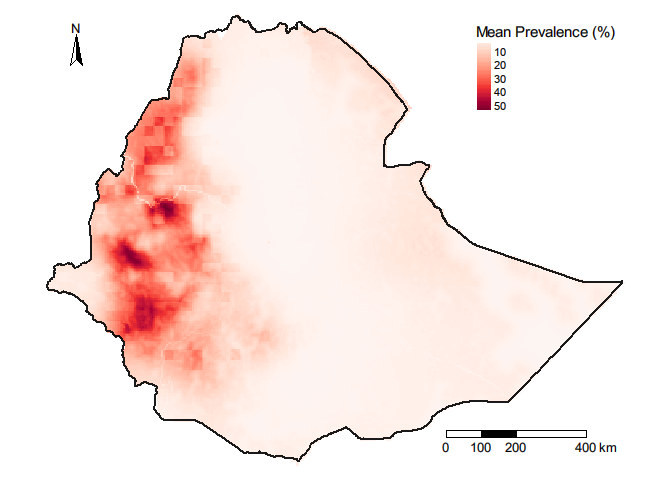

``` r
p_UL <- tm_shape(r_prev_ul*100) + 
  tm_raster(title="Prevalence (%): Upper limit", alpha = 1, palette = pal, legend.is.portrait = T, style = "cont", midpoint = 50) +
  tm_shape(m_0)+
  tm_borders(lty = 1, lwd = 2, col = "black", alpha = .9) +
  # tm_compass(type = "8star", position = c("left", "top")) +
  tm_scale_bar(breaks = c(0, 100, 200, 400), text.size = .8, position = c("right", "bottom")) +
  tm_layout(legend.outside = FALSE, legend.position = c("right", "top"), frame = FALSE, fontfamily = "Arial")


p_LL <- tm_shape(r_prev_ll*100) + 
  tm_raster(title="Prevalence (%): Lower limit", alpha = 1, palette = pal, legend.is.portrait = T, style = "cont", midpoint = 50) +
  tm_shape(m_0)+
  tm_borders(lty = 1, lwd = 2, col = "black", alpha = .9) +
  # tm_compass(type = "8star", position = c("left", "top")) +
  # tm_scale_bar(breaks = c(0, 100, 200, 400), text.size = .8, position = c("right", "bottom")) +
  tm_layout(legend.outside = FALSE, legend.position = c("right", "top"), frame = FALSE, fontfamily = "Arial")

tmap_arrange(p_LL, p_UL, ncol = 1)
```

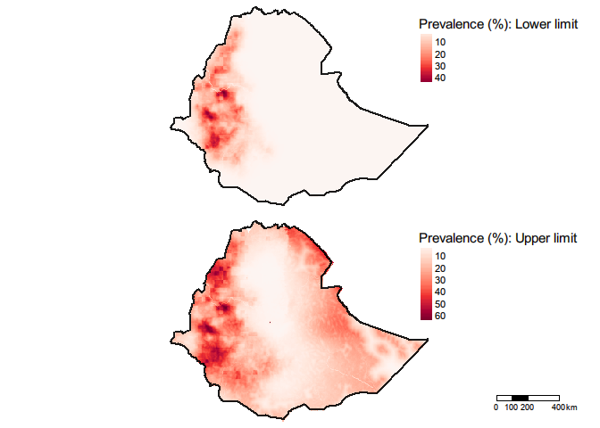

### Uncertainty map

``` r
data_sf <- st_as_sf(x = data, coords = c('LONG','LAT'), crs= "+proj=longlat +datum=WGS84")

pal <- hcl.colors(100, palette = "Blues", rev =TRUE)
p <- tm_shape(r_prev_sd*100) + 
  tm_raster(title="Prevalence(SD)", alpha = .8, palette = pal, legend.is.portrait = T, style = "cont") +
  tm_shape(m_0)+
  tm_borders(lty = 1, lwd = 2, col = "black", alpha = .9) +
  tm_shape(data_sf) + 
  tm_symbols(col = "black", shape = 3, alpha = .5, size = .07, legend.shape.show = T) +
  tm_compass(type = "arrow", position = c("left", "top")) +
  tm_scale_bar(breaks = c(0, 100, 200, 400), text.size = .8, position = c("right", "bottom")) +
  tm_layout(legend.outside = FALSE, legend.position = c("right", "top"), frame = FALSE, fontfamily = "Arial")
p
```

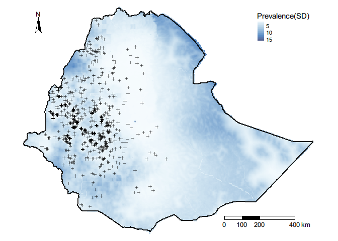

### Bivariate map

-   Thanks to this
    [blog](https://rfunctions.blogspot.com/2015/03/bivariate-maps-bivariatemap-function.html)
    #### Bivariate map functions

``` r
colmat<-function(nquantiles=10, upperleft=rgb(0,150,235, maxColorValue=255), upperright=rgb(130,0,80, maxColorValue=255), bottomleft="grey", bottomright=rgb(255,230,15, maxColorValue=255), xlab="x label", ylab="y label"){
  my.data<-seq(0,1,.01)
  my.class<-classIntervals(my.data,n=nquantiles,style="quantile")
  my.pal.1<-findColours(my.class,c(upperleft,bottomleft))
  my.pal.2<-findColours(my.class,c(upperright, bottomright))
  col.matrix<-matrix(nrow = 101, ncol = 101, NA)
  for(i in 1:101){
    my.col<-c(paste(my.pal.1[i]),paste(my.pal.2[i]))
    col.matrix[102-i,]<-findColours(my.class,my.col)}
  plot(c(1,1),pch=19,col=my.pal.1, cex=0.5,xlim=c(0,1),ylim=c(0,1),frame.plot=F, xlab=xlab, ylab=ylab,cex.lab=1.3)
  for(i in 1:101){
    col.temp<-col.matrix[i-1,]
    points(my.data,rep((i-1)/100,101),pch=15,col=col.temp, cex=1)}
  seqs<-seq(0,100,(100/nquantiles))
  seqs[1]<-1
  col.matrix<-col.matrix[c(seqs), c(seqs)]}
```

``` r
bivariate.map<-function(rasterx, rastery, colormatrix=col.matrix, nquantiles=10){
  quanmean<-getValues(rasterx)
  temp<-data.frame(quanmean, quantile=rep(NA, length(quanmean)))
  brks<-with(temp, quantile(temp,na.rm=TRUE, probs = c(seq(0,1,1/nquantiles))))
  r1<-within(temp, quantile <- cut(quanmean, breaks = brks, labels = 2:length(brks),include.lowest = TRUE))
  quantr<-data.frame(r1[,2]) 
  quanvar<-getValues(rastery)
  temp<-data.frame(quanvar, quantile=rep(NA, length(quanvar)))
  brks<-with(temp, quantile(temp,na.rm=TRUE, probs = c(seq(0,1,1/nquantiles))))
  r2<-within(temp, quantile <- cut(quanvar, breaks = brks, labels = 2:length(brks),include.lowest = TRUE))
  quantr2<-data.frame(r2[,2])
  as.numeric.factor<-function(x) {as.numeric(levels(x))[x]}
  col.matrix2<-colormatrix
  cn<-unique(colormatrix)
  for(i in 1:length(col.matrix2)){
    ifelse(is.na(col.matrix2[i]),col.matrix2[i]<-1,col.matrix2[i]<-which(col.matrix2[i]==cn)[1])}
  cols<-numeric(length(quantr[,1]))
  for(i in 1:length(quantr[,1])){
    a<-as.numeric.factor(quantr[i,1])
    b<-as.numeric.factor(quantr2[i,1])
    cols[i]<-as.numeric(col.matrix2[b,a])}
  r<-rasterx
  r[1:length(r)]<-cols
  return(r)}
```

#### Plot bivariate map

``` r
# Color matrix
col.matrix <-colmat(nquantiles=4, upperleft="lightgreen", upperright="#F0842B5E", 
                   bottomleft="#6EA2F0", bottomright="#B31212D4", xlab="Prevalence", ylab="Uncertainty" )
```

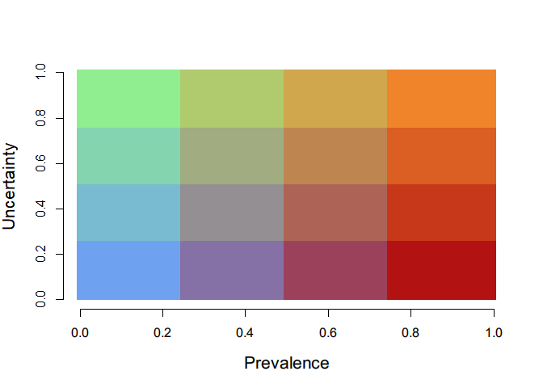

``` r
# Bivariate map
bivmap<-bivariate.map(r_prev_mean,r_prev_sd, colormatrix=col.matrix, nquantiles=4)
plot(bivmap,frame.plot=F,axes=F,box=F,add=F,legend=F,col=as.vector(col.matrix))
plot(st_geometry(m_0), add= T, lwd = 4)
```

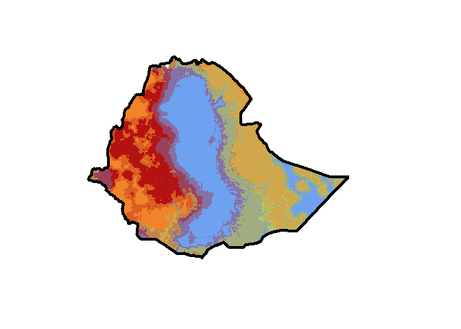

### Creating exceedance probability map

``` r
excprob_20 <- sapply(res$marginals.fitted.values[index],
                  FUN = function(marg){1-inla.pmarginal(q = 0.20, marginal = marg)})
raster_excprob_20 <- raster_prev(excprob_20)
```

``` r
pal <- hcl.colors(100, palette = "RdYlBu", rev =TRUE)


excprob_20_map <- tm_shape(raster_excprob_20) + 
  tm_raster(title="P (nodule prevalence > 20%)", alpha = 1, palette = pal, legend.is.portrait = T, style = "cont", midpoint = 0.5) +
  tm_shape(m)+
  tm_borders(lty = 1, lwd = 2, col = "black", alpha = .9) +
  tm_compass(type = "arrow", position = c("left", "top")) +
  tm_scale_bar(breaks = c(0, 100, 200, 400), text.size = .8, position = c("right", "bottom")) +
  tm_layout(legend.outside = FALSE, legend.position = c("right", "top"), frame = FALSE, fontfamily = "Arial")
excprob_20_map
```

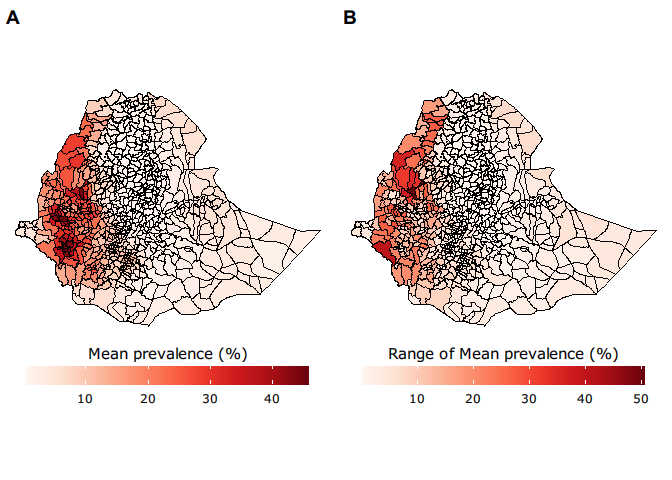

### Predicting case numbers

``` r
eth_pop_count2012 <- raster("data/eth_ppp_2012_1km_Aggregated_UNadj.tif")
eth_pop_count2012 %>% values() %>% sum(na.rm = t)  # actual value
```

    ## [1] 92726982

``` r
# custom function for reprojection
reproj <- function(tbc, c){
  tbc <- projectRaster(tbc, c)
  tbc <- resample(tbc, c)
  tbc <- mask(tbc, c)
}

load("data/220507_case_numbers.RData")
```

``` r
eth_pop_count <- reproj(eth_pop_count2012, covariates[[1]])
names(eth_pop_count) <- "eth_popcount_2012"
```

``` r
eth_popcount_5km <-  aggregate(eth_pop_count, fact = 5, fun = sum, na.rm = TRUE) # aggregating to 5 km
```

-   Excluding urban areas

``` r
# Custom function for reporjective categorical rasters
reproj_cat <- function(tbc, c){
  tbc <- projectRaster(tbc, c, method = "ngb")
  tbc <- resample(tbc, c, method = "ngb")
  tbc <- mask(tbc, c)
}
```

``` r
rur_urb_eth2015 <- raster("data/220401_rurban_eth_2015_1km.tif")
rur_urb_eth2015 %>% values() %>% as.factor() %>% summary()
```

    ##       0       1       2       3     NaN 
    ## 1078401   54158   16551    4974  982236

``` r
rururb_eth2015_reproj <- reproj_cat(rur_urb_eth2015, covariates[[1]])
rururb_eth2015_reproj %>% values() %>% as.factor() %>% summary()
```

``` r
rur_urb_eth2015_reproj_5km <-  aggregate(rururb_eth2015_reproj, fact = 5, fun = modal, na.rm = TRUE)
rur_urb_eth2015_reproj_5km %>% values() %>% as.factor() %>% summary()
```

    ##     0     1     2     3  NA's 
    ## 52324  1175   368   208 49585

``` r
# 2: semi-urban; 3: urban
rururb_nourban_5km <- reclassify(rur_urb_eth2015_reproj_5km, c(-Inf, 0, 1, 
                                                               0, 1, 1,
                                                                  1, Inf, NA))
rururb_nourban_5km[] %>% as.factor %>% summary
```

    ##     1  NA's 
    ## 53499 50161

``` r
eth_popcount2012_5km_nourban <- eth_popcount_5km * rururb_nourban_5km
eth_popcount2012_5km_nourban %>% values() %>% sum(na.rm = T)
```

    ## [1] 81809936

``` r
# Number of cases
mean_case <- eth_popcount2012_5km_nourban * r_prev_mean
mean_case %>% values() %>% sum(na.rm = T)
```

    ## [1] 6496944

``` r
LL_case <- eth_popcount2012_5km_nourban * r_prev_ll
LL_case %>% values() %>% sum(na.rm = T)
```

    ## [1] 3538941

``` r
UL_case <- eth_popcount2012_5km_nourban * r_prev_ul
UL_case %>% values() %>% sum(na.rm = T)
```

    ## [1] 13082408

``` r
eth_st2 <- getData(name = "GADM", country = "ETH", level = 3)
eth_sf2 <- eth_st2 %>% st_as_sf()

mean_cases <- exactextractr::exact_extract(mean_case, eth_sf2, fun = "sum") # faster
```

    ##   |                                                                              |                                                                      |   0%  |                                                                              |                                                                      |   1%  |                                                                              |=                                                                     |   1%  |                                                                              |=                                                                     |   2%  |                                                                              |==                                                                    |   2%  |                                                                              |==                                                                    |   3%  |                                                                              |===                                                                   |   4%  |                                                                              |===                                                                   |   5%  |                                                                              |====                                                                  |   5%  |                                                                              |====                                                                  |   6%  |                                                                              |=====                                                                 |   7%  |                                                                              |=====                                                                 |   8%  |                                                                              |======                                                                |   8%  |                                                                              |======                                                                |   9%  |                                                                              |=======                                                               |   9%  |                                                                              |=======                                                               |  10%  |                                                                              |=======                                                               |  11%  |                                                                              |========                                                              |  11%  |                                                                              |========                                                              |  12%  |                                                                              |=========                                                             |  12%  |                                                                              |=========                                                             |  13%  |                                                                              |==========                                                            |  14%  |                                                                              |==========                                                            |  15%  |                                                                              |===========                                                           |  15%  |                                                                              |===========                                                           |  16%  |                                                                              |============                                                          |  17%  |                                                                              |============                                                          |  18%  |                                                                              |=============                                                         |  18%  |                                                                              |=============                                                         |  19%  |                                                                              |==============                                                        |  19%  |                                                                              |==============                                                        |  20%  |                                                                              |==============                                                        |  21%  |                                                                              |===============                                                       |  21%  |                                                                              |===============                                                       |  22%  |                                                                              |================                                                      |  22%  |                                                                              |================                                                      |  23%  |                                                                              |=================                                                     |  24%  |                                                                              |=================                                                     |  25%  |                                                                              |==================                                                    |  25%  |                                                                              |==================                                                    |  26%  |                                                                              |===================                                                   |  27%  |                                                                              |===================                                                   |  28%  |                                                                              |====================                                                  |  28%  |                                                                              |====================                                                  |  29%  |                                                                              |=====================                                                 |  29%  |                                                                              |=====================                                                 |  30%  |                                                                              |=====================                                                 |  31%  |                                                                              |======================                                                |  31%  |                                                                              |======================                                                |  32%  |                                                                              |=======================                                               |  32%  |                                                                              |=======================                                               |  33%  |                                                                              |========================                                              |  34%  |                                                                              |========================                                              |  35%  |                                                                              |=========================                                             |  35%  |                                                                              |=========================                                             |  36%  |                                                                              |==========================                                            |  37%  |                                                                              |==========================                                            |  38%  |                                                                              |===========================                                           |  38%  |                                                                              |===========================                                           |  39%  |                                                                              |============================                                          |  39%  |                                                                              |============================                                          |  40%  |                                                                              |============================                                          |  41%  |                                                                              |=============================                                         |  41%  |                                                                              |=============================                                         |  42%  |                                                                              |==============================                                        |  42%  |                                                                              |==============================                                        |  43%  |                                                                              |===============================                                       |  44%  |                                                                              |===============================                                       |  45%  |                                                                              |================================                                      |  45%  |                                                                              |================================                                      |  46%  |                                                                              |=================================                                     |  47%  |                                                                              |=================================                                     |  48%  |                                                                              |==================================                                    |  48%  |                                                                              |==================================                                    |  49%  |                                                                              |===================================                                   |  49%  |                                                                              |===================================                                   |  50%  |                                                                              |===================================                                   |  51%  |                                                                              |====================================                                  |  51%  |                                                                              |====================================                                  |  52%  |                                                                              |=====================================                                 |  52%  |                                                                              |=====================================                                 |  53%  |                                                                              |======================================                                |  54%  |                                                                              |======================================                                |  55%  |                                                                              |=======================================                               |  55%  |                                                                              |=======================================                               |  56%  |                                                                              |========================================                              |  57%  |                                                                              |========================================                              |  58%  |                                                                              |=========================================                             |  58%  |                                                                              |=========================================                             |  59%  |                                                                              |==========================================                            |  59%  |                                                                              |==========================================                            |  60%  |                                                                              |==========================================                            |  61%  |                                                                              |===========================================                           |  61%  |                                                                              |===========================================                           |  62%  |                                                                              |============================================                          |  62%  |                                                                              |============================================                          |  63%  |                                                                              |=============================================                         |  64%  |                                                                              |=============================================                         |  65%  |                                                                              |==============================================                        |  65%  |                                                                              |==============================================                        |  66%  |                                                                              |===============================================                       |  67%  |                                                                              |===============================================                       |  68%  |                                                                              |================================================                      |  68%  |                                                                              |================================================                      |  69%  |                                                                              |=================================================                     |  69%  |                                                                              |=================================================                     |  70%  |                                                                              |=================================================                     |  71%  |                                                                              |==================================================                    |  71%  |                                                                              |==================================================                    |  72%  |                                                                              |===================================================                   |  72%  |                                                                              |===================================================                   |  73%  |                                                                              |====================================================                  |  74%  |                                                                              |====================================================                  |  75%  |                                                                              |=====================================================                 |  75%  |                                                                              |=====================================================                 |  76%  |                                                                              |======================================================                |  77%  |                                                                              |======================================================                |  78%  |                                                                              |=======================================================               |  78%  |                                                                              |=======================================================               |  79%  |                                                                              |========================================================              |  79%  |                                                                              |========================================================              |  80%  |                                                                              |========================================================              |  81%  |                                                                              |=========================================================             |  81%  |                                                                              |=========================================================             |  82%  |                                                                              |==========================================================            |  82%  |                                                                              |==========================================================            |  83%  |                                                                              |===========================================================           |  84%  |                                                                              |===========================================================           |  85%  |                                                                              |============================================================          |  85%  |                                                                              |============================================================          |  86%  |                                                                              |=============================================================         |  87%  |                                                                              |=============================================================         |  88%  |                                                                              |==============================================================        |  88%  |                                                                              |==============================================================        |  89%  |                                                                              |===============================================================       |  89%  |                                                                              |===============================================================       |  90%  |                                                                              |===============================================================       |  91%  |                                                                              |================================================================      |  91%  |                                                                              |================================================================      |  92%  |                                                                              |=================================================================     |  92%  |                                                                              |=================================================================     |  93%  |                                                                              |==================================================================    |  94%  |                                                                              |==================================================================    |  95%  |                                                                              |===================================================================   |  95%  |                                                                              |===================================================================   |  96%  |                                                                              |====================================================================  |  97%  |                                                                              |====================================================================  |  98%  |                                                                              |===================================================================== |  98%  |                                                                              |===================================================================== |  99%  |                                                                              |======================================================================|  99%  |                                                                              |======================================================================| 100%

``` r
eth_sf2$mean_cases <- mean_cases/1000

LL_cases <- exactextractr::exact_extract(LL_case, eth_sf2, fun = "sum") # faster
```

    ##   |                                                                              |                                                                      |   0%  |                                                                              |                                                                      |   1%  |                                                                              |=                                                                     |   1%  |                                                                              |=                                                                     |   2%  |                                                                              |==                                                                    |   2%  |                                                                              |==                                                                    |   3%  |                                                                              |===                                                                   |   4%  |                                                                              |===                                                                   |   5%  |                                                                              |====                                                                  |   5%  |                                                                              |====                                                                  |   6%  |                                                                              |=====                                                                 |   7%  |                                                                              |=====                                                                 |   8%  |                                                                              |======                                                                |   8%  |                                                                              |======                                                                |   9%  |                                                                              |=======                                                               |   9%  |                                                                              |=======                                                               |  10%  |                                                                              |=======                                                               |  11%  |                                                                              |========                                                              |  11%  |                                                                              |========                                                              |  12%  |                                                                              |=========                                                             |  12%  |                                                                              |=========                                                             |  13%  |                                                                              |==========                                                            |  14%  |                                                                              |==========                                                            |  15%  |                                                                              |===========                                                           |  15%  |                                                                              |===========                                                           |  16%  |                                                                              |============                                                          |  17%  |                                                                              |============                                                          |  18%  |                                                                              |=============                                                         |  18%  |                                                                              |=============                                                         |  19%  |                                                                              |==============                                                        |  19%  |                                                                              |==============                                                        |  20%  |                                                                              |==============                                                        |  21%  |                                                                              |===============                                                       |  21%  |                                                                              |===============                                                       |  22%  |                                                                              |================                                                      |  22%  |                                                                              |================                                                      |  23%  |                                                                              |=================                                                     |  24%  |                                                                              |=================                                                     |  25%  |                                                                              |==================                                                    |  25%  |                                                                              |==================                                                    |  26%  |                                                                              |===================                                                   |  27%  |                                                                              |===================                                                   |  28%  |                                                                              |====================                                                  |  28%  |                                                                              |====================                                                  |  29%  |                                                                              |=====================                                                 |  29%  |                                                                              |=====================                                                 |  30%  |                                                                              |=====================                                                 |  31%  |                                                                              |======================                                                |  31%  |                                                                              |======================                                                |  32%  |                                                                              |=======================                                               |  32%  |                                                                              |=======================                                               |  33%  |                                                                              |========================                                              |  34%  |                                                                              |========================                                              |  35%  |                                                                              |=========================                                             |  35%  |                                                                              |=========================                                             |  36%  |                                                                              |==========================                                            |  37%  |                                                                              |==========================                                            |  38%  |                                                                              |===========================                                           |  38%  |                                                                              |===========================                                           |  39%  |                                                                              |============================                                          |  39%  |                                                                              |============================                                          |  40%  |                                                                              |============================                                          |  41%  |                                                                              |=============================                                         |  41%  |                                                                              |=============================                                         |  42%  |                                                                              |==============================                                        |  42%  |                                                                              |==============================                                        |  43%  |                                                                              |===============================                                       |  44%  |                                                                              |===============================                                       |  45%  |                                                                              |================================                                      |  45%  |                                                                              |================================                                      |  46%  |                                                                              |=================================                                     |  47%  |                                                                              |=================================                                     |  48%  |                                                                              |==================================                                    |  48%  |                                                                              |==================================                                    |  49%  |                                                                              |===================================                                   |  49%  |                                                                              |===================================                                   |  50%  |                                                                              |===================================                                   |  51%  |                                                                              |====================================                                  |  51%  |                                                                              |====================================                                  |  52%  |                                                                              |=====================================                                 |  52%  |                                                                              |=====================================                                 |  53%  |                                                                              |======================================                                |  54%  |                                                                              |======================================                                |  55%  |                                                                              |=======================================                               |  55%  |                                                                              |=======================================                               |  56%  |                                                                              |========================================                              |  57%  |                                                                              |========================================                              |  58%  |                                                                              |=========================================                             |  58%  |                                                                              |=========================================                             |  59%  |                                                                              |==========================================                            |  59%  |                                                                              |==========================================                            |  60%  |                                                                              |==========================================                            |  61%  |                                                                              |===========================================                           |  61%  |                                                                              |===========================================                           |  62%  |                                                                              |============================================                          |  62%  |                                                                              |============================================                          |  63%  |                                                                              |=============================================                         |  64%  |                                                                              |=============================================                         |  65%  |                                                                              |==============================================                        |  65%  |                                                                              |==============================================                        |  66%  |                                                                              |===============================================                       |  67%  |                                                                              |===============================================                       |  68%  |                                                                              |================================================                      |  68%  |                                                                              |================================================                      |  69%  |                                                                              |=================================================                     |  69%  |                                                                              |=================================================                     |  70%  |                                                                              |=================================================                     |  71%  |                                                                              |==================================================                    |  71%  |                                                                              |==================================================                    |  72%  |                                                                              |===================================================                   |  72%  |                                                                              |===================================================                   |  73%  |                                                                              |====================================================                  |  74%  |                                                                              |====================================================                  |  75%  |                                                                              |=====================================================                 |  75%  |                                                                              |=====================================================                 |  76%  |                                                                              |======================================================                |  77%  |                                                                              |======================================================                |  78%  |                                                                              |=======================================================               |  78%  |                                                                              |=======================================================               |  79%  |                                                                              |========================================================              |  79%  |                                                                              |========================================================              |  80%  |                                                                              |========================================================              |  81%  |                                                                              |=========================================================             |  81%  |                                                                              |=========================================================             |  82%  |                                                                              |==========================================================            |  82%  |                                                                              |==========================================================            |  83%  |                                                                              |===========================================================           |  84%  |                                                                              |===========================================================           |  85%  |                                                                              |============================================================          |  85%  |                                                                              |============================================================          |  86%  |                                                                              |=============================================================         |  87%  |                                                                              |=============================================================         |  88%  |                                                                              |==============================================================        |  88%  |                                                                              |==============================================================        |  89%  |                                                                              |===============================================================       |  89%  |                                                                              |===============================================================       |  90%  |                                                                              |===============================================================       |  91%  |                                                                              |================================================================      |  91%  |                                                                              |================================================================      |  92%  |                                                                              |=================================================================     |  92%  |                                                                              |=================================================================     |  93%  |                                                                              |==================================================================    |  94%  |                                                                              |==================================================================    |  95%  |                                                                              |===================================================================   |  95%  |                                                                              |===================================================================   |  96%  |                                                                              |====================================================================  |  97%  |                                                                              |====================================================================  |  98%  |                                                                              |===================================================================== |  98%  |                                                                              |===================================================================== |  99%  |                                                                              |======================================================================|  99%  |                                                                              |======================================================================| 100%

``` r
eth_sf2$LL_cases <- LL_cases/1000

UL_cases <- exactextractr::exact_extract(UL_case, eth_sf2, fun = "sum") # faster
```

    ##   |                                                                              |                                                                      |   0%  |                                                                              |                                                                      |   1%  |                                                                              |=                                                                     |   1%  |                                                                              |=                                                                     |   2%  |                                                                              |==                                                                    |   2%  |                                                                              |==                                                                    |   3%  |                                                                              |===                                                                   |   4%  |                                                                              |===                                                                   |   5%  |                                                                              |====                                                                  |   5%  |                                                                              |====                                                                  |   6%  |                                                                              |=====                                                                 |   7%  |                                                                              |=====                                                                 |   8%  |                                                                              |======                                                                |   8%  |                                                                              |======                                                                |   9%  |                                                                              |=======                                                               |   9%  |                                                                              |=======                                                               |  10%  |                                                                              |=======                                                               |  11%  |                                                                              |========                                                              |  11%  |                                                                              |========                                                              |  12%  |                                                                              |=========                                                             |  12%  |                                                                              |=========                                                             |  13%  |                                                                              |==========                                                            |  14%  |                                                                              |==========                                                            |  15%  |                                                                              |===========                                                           |  15%  |                                                                              |===========                                                           |  16%  |                                                                              |============                                                          |  17%  |                                                                              |============                                                          |  18%  |                                                                              |=============                                                         |  18%  |                                                                              |=============                                                         |  19%  |                                                                              |==============                                                        |  19%  |                                                                              |==============                                                        |  20%  |                                                                              |==============                                                        |  21%  |                                                                              |===============                                                       |  21%  |                                                                              |===============                                                       |  22%  |                                                                              |================                                                      |  22%  |                                                                              |================                                                      |  23%  |                                                                              |=================                                                     |  24%  |                                                                              |=================                                                     |  25%  |                                                                              |==================                                                    |  25%  |                                                                              |==================                                                    |  26%  |                                                                              |===================                                                   |  27%  |                                                                              |===================                                                   |  28%  |                                                                              |====================                                                  |  28%  |                                                                              |====================                                                  |  29%  |                                                                              |=====================                                                 |  29%  |                                                                              |=====================                                                 |  30%  |                                                                              |=====================                                                 |  31%  |                                                                              |======================                                                |  31%  |                                                                              |======================                                                |  32%  |                                                                              |=======================                                               |  32%  |                                                                              |=======================                                               |  33%  |                                                                              |========================                                              |  34%  |                                                                              |========================                                              |  35%  |                                                                              |=========================                                             |  35%  |                                                                              |=========================                                             |  36%  |                                                                              |==========================                                            |  37%  |                                                                              |==========================                                            |  38%  |                                                                              |===========================                                           |  38%  |                                                                              |===========================                                           |  39%  |                                                                              |============================                                          |  39%  |                                                                              |============================                                          |  40%  |                                                                              |============================                                          |  41%  |                                                                              |=============================                                         |  41%  |                                                                              |=============================                                         |  42%  |                                                                              |==============================                                        |  42%  |                                                                              |==============================                                        |  43%  |                                                                              |===============================                                       |  44%  |                                                                              |===============================                                       |  45%  |                                                                              |================================                                      |  45%  |                                                                              |================================                                      |  46%  |                                                                              |=================================                                     |  47%  |                                                                              |=================================                                     |  48%  |                                                                              |==================================                                    |  48%  |                                                                              |==================================                                    |  49%  |                                                                              |===================================                                   |  49%  |                                                                              |===================================                                   |  50%  |                                                                              |===================================                                   |  51%  |                                                                              |====================================                                  |  51%  |                                                                              |====================================                                  |  52%  |                                                                              |=====================================                                 |  52%  |                                                                              |=====================================                                 |  53%  |                                                                              |======================================                                |  54%  |                                                                              |======================================                                |  55%  |                                                                              |=======================================                               |  55%  |                                                                              |=======================================                               |  56%  |                                                                              |========================================                              |  57%  |                                                                              |========================================                              |  58%  |                                                                              |=========================================                             |  58%  |                                                                              |=========================================                             |  59%  |                                                                              |==========================================                            |  59%  |                                                                              |==========================================                            |  60%  |                                                                              |==========================================                            |  61%  |                                                                              |===========================================                           |  61%  |                                                                              |===========================================                           |  62%  |                                                                              |============================================                          |  62%  |                                                                              |============================================                          |  63%  |                                                                              |=============================================                         |  64%  |                                                                              |=============================================                         |  65%  |                                                                              |==============================================                        |  65%  |                                                                              |==============================================                        |  66%  |                                                                              |===============================================                       |  67%  |                                                                              |===============================================                       |  68%  |                                                                              |================================================                      |  68%  |                                                                              |================================================                      |  69%  |                                                                              |=================================================                     |  69%  |                                                                              |=================================================                     |  70%  |                                                                              |=================================================                     |  71%  |                                                                              |==================================================                    |  71%  |                                                                              |==================================================                    |  72%  |                                                                              |===================================================                   |  72%  |                                                                              |===================================================                   |  73%  |                                                                              |====================================================                  |  74%  |                                                                              |====================================================                  |  75%  |                                                                              |=====================================================                 |  75%  |                                                                              |=====================================================                 |  76%  |                                                                              |======================================================                |  77%  |                                                                              |======================================================                |  78%  |                                                                              |=======================================================               |  78%  |                                                                              |=======================================================               |  79%  |                                                                              |========================================================              |  79%  |                                                                              |========================================================              |  80%  |                                                                              |========================================================              |  81%  |                                                                              |=========================================================             |  81%  |                                                                              |=========================================================             |  82%  |                                                                              |==========================================================            |  82%  |                                                                              |==========================================================            |  83%  |                                                                              |===========================================================           |  84%  |                                                                              |===========================================================           |  85%  |                                                                              |============================================================          |  85%  |                                                                              |============================================================          |  86%  |                                                                              |=============================================================         |  87%  |                                                                              |=============================================================         |  88%  |                                                                              |==============================================================        |  88%  |                                                                              |==============================================================        |  89%  |                                                                              |===============================================================       |  89%  |                                                                              |===============================================================       |  90%  |                                                                              |===============================================================       |  91%  |                                                                              |================================================================      |  91%  |                                                                              |================================================================      |  92%  |                                                                              |=================================================================     |  92%  |                                                                              |=================================================================     |  93%  |                                                                              |==================================================================    |  94%  |                                                                              |==================================================================    |  95%  |                                                                              |===================================================================   |  95%  |                                                                              |===================================================================   |  96%  |                                                                              |====================================================================  |  97%  |                                                                              |====================================================================  |  98%  |                                                                              |===================================================================== |  98%  |                                                                              |===================================================================== |  99%  |                                                                              |======================================================================|  99%  |                                                                              |======================================================================| 100%

``` r
eth_sf2$UL_cases <- UL_cases/1000
```

``` r
mypalette <- colorRampPalette((brewer.pal(9, "Reds")))
mean_agg_cases <- ggplot()+
  geom_sf(data = eth_sf2, aes(fill = mean_cases), col = "black", lwd = .3) +
  geom_sf(data = m_0, col = "black", lwd = .8, alpha = 0) + 
  # scale_fill_gradientn(colours = mypalette(120), limits = c(0,120), breaks = seq(0,120, 20)) +
    scale_fill_gradientn(colours = mypalette(100)) +
  labs(fill = "Estimated aggregated cases, mean (x1000)") +
  theme_void(base_family = "Arial") +
  theme(legend.position = "bottom", legend.key.size = unit(2, 'cm'), #change legend key size
        legend.key.height = unit(.5, 'cm'), #change legend key height
        legend.key.width = unit(1.5, 'cm')) +
  guides(fill = guide_colourbar(title.position="top", title.hjust = 0.5)) +  annotation_scale(location = "br", width_hint = 0.5)  +
  annotation_north_arrow(location = "tl", which_north = "true",
        pad_x = unit(0.15, "in"), pad_y = unit(0.25, "in"),
        style = north_arrow_fancy_orienteering)


LL_agg_cases <- ggplot()+
  geom_sf(data = eth_sf2, aes(fill = LL_cases), col = "black", lwd = .3) +
  geom_sf(data = m_0, col = "black", lwd = .8, alpha = 0) + 
  # scale_fill_gradientn(colours = mypalette(120), limits = c(0,120), breaks = seq(0,120, 20)) +
  scale_fill_gradientn(colours = mypalette(100)) +
  labs(fill = "Estimated aggregated cases, Lower limit (x1000)") +
  theme_void(base_family = "Arial") +
  theme(legend.position = "bottom", legend.key.size = unit(2, 'cm'), #change legend key size
        legend.key.height = unit(.5, 'cm'), #change legend key height
        legend.key.width = unit(1.5, 'cm')) +
  guides(fill = guide_colourbar(title.position="top", title.hjust = 0.5)) +  annotation_scale(location = "br", width_hint = 0.5)

UL_agg_cases <- ggplot()+
  geom_sf(data = eth_sf2, aes(fill = UL_cases), col = "black", lwd = .3) +
  geom_sf(data = m_0, col = "black", lwd = .8, alpha = 0) + 
  scale_fill_gradientn(colours = mypalette(120), limits = c(0,120), breaks = seq(0,120, 20)) +
  # scale_fill_gradientn(colours = mypalette(100)) +
  labs(fill = "Estimated aggregated cases, Upper limit (x1000)") +
  theme_void(base_family = "Arial") +
  theme(legend.position = "bottom", legend.key.size = unit(2, 'cm'), #change legend key size
        legend.key.height = unit(.5, 'cm'), #change legend key height
        legend.key.width = unit(1.5, 'cm')) +
  guides(fill = guide_colourbar(title.position="top", title.hjust = 0.5)) +  annotation_scale(location = "br", width_hint = 0.5)

library(patchwork)
p_agg <- mean_agg_cases + (UL_agg_cases/LL_agg_cases) + plot_annotation(tag_levels = "A")
p_agg
```

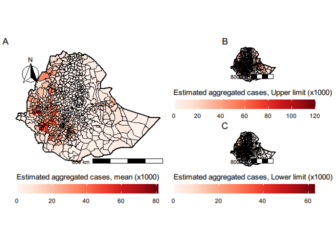

### Aggregated map on district level

``` r
mean_prev <- exactextractr::exact_extract(r_prev_mean *100, eth_sf2, fun = "mean") # faster
```

    ##   |                                                                              |                                                                      |   0%  |                                                                              |                                                                      |   1%  |                                                                              |=                                                                     |   1%  |                                                                              |=                                                                     |   2%  |                                                                              |==                                                                    |   2%  |                                                                              |==                                                                    |   3%  |                                                                              |===                                                                   |   4%  |                                                                              |===                                                                   |   5%  |                                                                              |====                                                                  |   5%  |                                                                              |====                                                                  |   6%  |                                                                              |=====                                                                 |   7%  |                                                                              |=====                                                                 |   8%  |                                                                              |======                                                                |   8%  |                                                                              |======                                                                |   9%  |                                                                              |=======                                                               |   9%  |                                                                              |=======                                                               |  10%  |                                                                              |=======                                                               |  11%  |                                                                              |========                                                              |  11%  |                                                                              |========                                                              |  12%  |                                                                              |=========                                                             |  12%  |                                                                              |=========                                                             |  13%  |                                                                              |==========                                                            |  14%  |                                                                              |==========                                                            |  15%  |                                                                              |===========                                                           |  15%  |                                                                              |===========                                                           |  16%  |                                                                              |============                                                          |  17%  |                                                                              |============                                                          |  18%  |                                                                              |=============                                                         |  18%  |                                                                              |=============                                                         |  19%  |                                                                              |==============                                                        |  19%  |                                                                              |==============                                                        |  20%  |                                                                              |==============                                                        |  21%  |                                                                              |===============                                                       |  21%  |                                                                              |===============                                                       |  22%  |                                                                              |================                                                      |  22%  |                                                                              |================                                                      |  23%  |                                                                              |=================                                                     |  24%  |                                                                              |=================                                                     |  25%  |                                                                              |==================                                                    |  25%  |                                                                              |==================                                                    |  26%  |                                                                              |===================                                                   |  27%  |                                                                              |===================                                                   |  28%  |                                                                              |====================                                                  |  28%  |                                                                              |====================                                                  |  29%  |                                                                              |=====================                                                 |  29%  |                                                                              |=====================                                                 |  30%  |                                                                              |=====================                                                 |  31%  |                                                                              |======================                                                |  31%  |                                                                              |======================                                                |  32%  |                                                                              |=======================                                               |  32%  |                                                                              |=======================                                               |  33%  |                                                                              |========================                                              |  34%  |                                                                              |========================                                              |  35%  |                                                                              |=========================                                             |  35%  |                                                                              |=========================                                             |  36%  |                                                                              |==========================                                            |  37%  |                                                                              |==========================                                            |  38%  |                                                                              |===========================                                           |  38%  |                                                                              |===========================                                           |  39%  |                                                                              |============================                                          |  39%  |                                                                              |============================                                          |  40%  |                                                                              |============================                                          |  41%  |                                                                              |=============================                                         |  41%  |                                                                              |=============================                                         |  42%  |                                                                              |==============================                                        |  42%  |                                                                              |==============================                                        |  43%  |                                                                              |===============================                                       |  44%  |                                                                              |===============================                                       |  45%  |                                                                              |================================                                      |  45%  |                                                                              |================================                                      |  46%  |                                                                              |=================================                                     |  47%  |                                                                              |=================================                                     |  48%  |                                                                              |==================================                                    |  48%  |                                                                              |==================================                                    |  49%  |                                                                              |===================================                                   |  49%  |                                                                              |===================================                                   |  50%  |                                                                              |===================================                                   |  51%  |                                                                              |====================================                                  |  51%  |                                                                              |====================================                                  |  52%  |                                                                              |=====================================                                 |  52%  |                                                                              |=====================================                                 |  53%  |                                                                              |======================================                                |  54%  |                                                                              |======================================                                |  55%  |                                                                              |=======================================                               |  55%  |                                                                              |=======================================                               |  56%  |                                                                              |========================================                              |  57%  |                                                                              |========================================                              |  58%  |                                                                              |=========================================                             |  58%  |                                                                              |=========================================                             |  59%  |                                                                              |==========================================                            |  59%  |                                                                              |==========================================                            |  60%  |                                                                              |==========================================                            |  61%  |                                                                              |===========================================                           |  61%  |                                                                              |===========================================                           |  62%  |                                                                              |============================================                          |  62%  |                                                                              |============================================                          |  63%  |                                                                              |=============================================                         |  64%  |                                                                              |=============================================                         |  65%  |                                                                              |==============================================                        |  65%  |                                                                              |==============================================                        |  66%  |                                                                              |===============================================                       |  67%  |                                                                              |===============================================                       |  68%  |                                                                              |================================================                      |  68%  |                                                                              |================================================                      |  69%  |                                                                              |=================================================                     |  69%  |                                                                              |=================================================                     |  70%  |                                                                              |=================================================                     |  71%  |                                                                              |==================================================                    |  71%  |                                                                              |==================================================                    |  72%  |                                                                              |===================================================                   |  72%  |                                                                              |===================================================                   |  73%  |                                                                              |====================================================                  |  74%  |                                                                              |====================================================                  |  75%  |                                                                              |=====================================================                 |  75%  |                                                                              |=====================================================                 |  76%  |                                                                              |======================================================                |  77%  |                                                                              |======================================================                |  78%  |                                                                              |=======================================================               |  78%  |                                                                              |=======================================================               |  79%  |                                                                              |========================================================              |  79%  |                                                                              |========================================================              |  80%  |                                                                              |========================================================              |  81%  |                                                                              |=========================================================             |  81%  |                                                                              |=========================================================             |  82%  |                                                                              |==========================================================            |  82%  |                                                                              |==========================================================            |  83%  |                                                                              |===========================================================           |  84%  |                                                                              |===========================================================           |  85%  |                                                                              |============================================================          |  85%  |                                                                              |============================================================          |  86%  |                                                                              |=============================================================         |  87%  |                                                                              |=============================================================         |  88%  |                                                                              |==============================================================        |  88%  |                                                                              |==============================================================        |  89%  |                                                                              |===============================================================       |  89%  |                                                                              |===============================================================       |  90%  |                                                                              |===============================================================       |  91%  |                                                                              |================================================================      |  91%  |                                                                              |================================================================      |  92%  |                                                                              |=================================================================     |  92%  |                                                                              |=================================================================     |  93%  |                                                                              |==================================================================    |  94%  |                                                                              |==================================================================    |  95%  |                                                                              |===================================================================   |  95%  |                                                                              |===================================================================   |  96%  |                                                                              |====================================================================  |  97%  |                                                                              |====================================================================  |  98%  |                                                                              |===================================================================== |  98%  |                                                                              |===================================================================== |  99%  |                                                                              |======================================================================|  99%  |                                                                              |======================================================================| 100%

``` r
eth_sf2$INLA_prev_mean <- mean_prev

sd_prev <- exactextractr::exact_extract(r_prev_sd*100, eth_sf2, fun = "mean") # faster
```

    ##   |                                                                              |                                                                      |   0%  |                                                                              |                                                                      |   1%  |                                                                              |=                                                                     |   1%  |                                                                              |=                                                                     |   2%  |                                                                              |==                                                                    |   2%  |                                                                              |==                                                                    |   3%  |                                                                              |===                                                                   |   4%  |                                                                              |===                                                                   |   5%  |                                                                              |====                                                                  |   5%  |                                                                              |====                                                                  |   6%  |                                                                              |=====                                                                 |   7%  |                                                                              |=====                                                                 |   8%  |                                                                              |======                                                                |   8%  |                                                                              |======                                                                |   9%  |                                                                              |=======                                                               |   9%  |                                                                              |=======                                                               |  10%  |                                                                              |=======                                                               |  11%  |                                                                              |========                                                              |  11%  |                                                                              |========                                                              |  12%  |                                                                              |=========                                                             |  12%  |                                                                              |=========                                                             |  13%  |                                                                              |==========                                                            |  14%  |                                                                              |==========                                                            |  15%  |                                                                              |===========                                                           |  15%  |                                                                              |===========                                                           |  16%  |                                                                              |============                                                          |  17%  |                                                                              |============                                                          |  18%  |                                                                              |=============                                                         |  18%  |                                                                              |=============                                                         |  19%  |                                                                              |==============                                                        |  19%  |                                                                              |==============                                                        |  20%  |                                                                              |==============                                                        |  21%  |                                                                              |===============                                                       |  21%  |                                                                              |===============                                                       |  22%  |                                                                              |================                                                      |  22%  |                                                                              |================                                                      |  23%  |                                                                              |=================                                                     |  24%  |                                                                              |=================                                                     |  25%  |                                                                              |==================                                                    |  25%  |                                                                              |==================                                                    |  26%  |                                                                              |===================                                                   |  27%  |                                                                              |===================                                                   |  28%  |                                                                              |====================                                                  |  28%  |                                                                              |====================                                                  |  29%  |                                                                              |=====================                                                 |  29%  |                                                                              |=====================                                                 |  30%  |                                                                              |=====================                                                 |  31%  |                                                                              |======================                                                |  31%  |                                                                              |======================                                                |  32%  |                                                                              |=======================                                               |  32%  |                                                                              |=======================                                               |  33%  |                                                                              |========================                                              |  34%  |                                                                              |========================                                              |  35%  |                                                                              |=========================                                             |  35%  |                                                                              |=========================                                             |  36%  |                                                                              |==========================                                            |  37%  |                                                                              |==========================                                            |  38%  |                                                                              |===========================                                           |  38%  |                                                                              |===========================                                           |  39%  |                                                                              |============================                                          |  39%  |                                                                              |============================                                          |  40%  |                                                                              |============================                                          |  41%  |                                                                              |=============================                                         |  41%  |                                                                              |=============================                                         |  42%  |                                                                              |==============================                                        |  42%  |                                                                              |==============================                                        |  43%  |                                                                              |===============================                                       |  44%  |                                                                              |===============================                                       |  45%  |                                                                              |================================                                      |  45%  |                                                                              |================================                                      |  46%  |                                                                              |=================================                                     |  47%  |                                                                              |=================================                                     |  48%  |                                                                              |==================================                                    |  48%  |                                                                              |==================================                                    |  49%  |                                                                              |===================================                                   |  49%  |                                                                              |===================================                                   |  50%  |                                                                              |===================================                                   |  51%  |                                                                              |====================================                                  |  51%  |                                                                              |====================================                                  |  52%  |                                                                              |=====================================                                 |  52%  |                                                                              |=====================================                                 |  53%  |                                                                              |======================================                                |  54%  |                                                                              |======================================                                |  55%  |                                                                              |=======================================                               |  55%  |                                                                              |=======================================                               |  56%  |                                                                              |========================================                              |  57%  |                                                                              |========================================                              |  58%  |                                                                              |=========================================                             |  58%  |                                                                              |=========================================                             |  59%  |                                                                              |==========================================                            |  59%  |                                                                              |==========================================                            |  60%  |                                                                              |==========================================                            |  61%  |                                                                              |===========================================                           |  61%  |                                                                              |===========================================                           |  62%  |                                                                              |============================================                          |  62%  |                                                                              |============================================                          |  63%  |                                                                              |=============================================                         |  64%  |                                                                              |=============================================                         |  65%  |                                                                              |==============================================                        |  65%  |                                                                              |==============================================                        |  66%  |                                                                              |===============================================                       |  67%  |                                                                              |===============================================                       |  68%  |                                                                              |================================================                      |  68%  |                                                                              |================================================                      |  69%  |                                                                              |=================================================                     |  69%  |                                                                              |=================================================                     |  70%  |                                                                              |=================================================                     |  71%  |                                                                              |==================================================                    |  71%  |                                                                              |==================================================                    |  72%  |                                                                              |===================================================                   |  72%  |                                                                              |===================================================                   |  73%  |                                                                              |====================================================                  |  74%  |                                                                              |====================================================                  |  75%  |                                                                              |=====================================================                 |  75%  |                                                                              |=====================================================                 |  76%  |                                                                              |======================================================                |  77%  |                                                                              |======================================================                |  78%  |                                                                              |=======================================================               |  78%  |                                                                              |=======================================================               |  79%  |                                                                              |========================================================              |  79%  |                                                                              |========================================================              |  80%  |                                                                              |========================================================              |  81%  |                                                                              |=========================================================             |  81%  |                                                                              |=========================================================             |  82%  |                                                                              |==========================================================            |  82%  |                                                                              |==========================================================            |  83%  |                                                                              |===========================================================           |  84%  |                                                                              |===========================================================           |  85%  |                                                                              |============================================================          |  85%  |                                                                              |============================================================          |  86%  |                                                                              |=============================================================         |  87%  |                                                                              |=============================================================         |  88%  |                                                                              |==============================================================        |  88%  |                                                                              |==============================================================        |  89%  |                                                                              |===============================================================       |  89%  |                                                                              |===============================================================       |  90%  |                                                                              |===============================================================       |  91%  |                                                                              |================================================================      |  91%  |                                                                              |================================================================      |  92%  |                                                                              |=================================================================     |  92%  |                                                                              |=================================================================     |  93%  |                                                                              |==================================================================    |  94%  |                                                                              |==================================================================    |  95%  |                                                                              |===================================================================   |  95%  |                                                                              |===================================================================   |  96%  |                                                                              |====================================================================  |  97%  |                                                                              |====================================================================  |  98%  |                                                                              |===================================================================== |  98%  |                                                                              |===================================================================== |  99%  |                                                                              |======================================================================|  99%  |                                                                              |======================================================================| 100%

``` r
eth_sf2$INLA_prev_sd <- sd_prev

min_prev <- exactextractr::exact_extract(r_prev_mean *100, eth_sf2, fun = "min") # faster
```

    ##   |                                                                              |                                                                      |   0%  |                                                                              |                                                                      |   1%  |                                                                              |=                                                                     |   1%  |                                                                              |=                                                                     |   2%  |                                                                              |==                                                                    |   2%  |                                                                              |==                                                                    |   3%  |                                                                              |===                                                                   |   4%  |                                                                              |===                                                                   |   5%  |                                                                              |====                                                                  |   5%  |                                                                              |====                                                                  |   6%  |                                                                              |=====                                                                 |   7%  |                                                                              |=====                                                                 |   8%  |                                                                              |======                                                                |   8%  |                                                                              |======                                                                |   9%  |                                                                              |=======                                                               |   9%  |                                                                              |=======                                                               |  10%  |                                                                              |=======                                                               |  11%  |                                                                              |========                                                              |  11%  |                                                                              |========                                                              |  12%  |                                                                              |=========                                                             |  12%  |                                                                              |=========                                                             |  13%  |                                                                              |==========                                                            |  14%  |                                                                              |==========                                                            |  15%  |                                                                              |===========                                                           |  15%  |                                                                              |===========                                                           |  16%  |                                                                              |============                                                          |  17%  |                                                                              |============                                                          |  18%  |                                                                              |=============                                                         |  18%  |                                                                              |=============                                                         |  19%  |                                                                              |==============                                                        |  19%  |                                                                              |==============                                                        |  20%  |                                                                              |==============                                                        |  21%  |                                                                              |===============                                                       |  21%  |                                                                              |===============                                                       |  22%  |                                                                              |================                                                      |  22%  |                                                                              |================                                                      |  23%  |                                                                              |=================                                                     |  24%  |                                                                              |=================                                                     |  25%  |                                                                              |==================                                                    |  25%  |                                                                              |==================                                                    |  26%  |                                                                              |===================                                                   |  27%  |                                                                              |===================                                                   |  28%  |                                                                              |====================                                                  |  28%  |                                                                              |====================                                                  |  29%  |                                                                              |=====================                                                 |  29%  |                                                                              |=====================                                                 |  30%  |                                                                              |=====================                                                 |  31%  |                                                                              |======================                                                |  31%  |                                                                              |======================                                                |  32%  |                                                                              |=======================                                               |  32%  |                                                                              |=======================                                               |  33%  |                                                                              |========================                                              |  34%  |                                                                              |========================                                              |  35%  |                                                                              |=========================                                             |  35%  |                                                                              |=========================                                             |  36%  |                                                                              |==========================                                            |  37%  |                                                                              |==========================                                            |  38%  |                                                                              |===========================                                           |  38%  |                                                                              |===========================                                           |  39%  |                                                                              |============================                                          |  39%  |                                                                              |============================                                          |  40%  |                                                                              |============================                                          |  41%  |                                                                              |=============================                                         |  41%  |                                                                              |=============================                                         |  42%  |                                                                              |==============================                                        |  42%  |                                                                              |==============================                                        |  43%  |                                                                              |===============================                                       |  44%  |                                                                              |===============================                                       |  45%  |                                                                              |================================                                      |  45%  |                                                                              |================================                                      |  46%  |                                                                              |=================================                                     |  47%  |                                                                              |=================================                                     |  48%  |                                                                              |==================================                                    |  48%  |                                                                              |==================================                                    |  49%  |                                                                              |===================================                                   |  49%  |                                                                              |===================================                                   |  50%  |                                                                              |===================================                                   |  51%  |                                                                              |====================================                                  |  51%  |                                                                              |====================================                                  |  52%  |                                                                              |=====================================                                 |  52%  |                                                                              |=====================================                                 |  53%  |                                                                              |======================================                                |  54%  |                                                                              |======================================                                |  55%  |                                                                              |=======================================                               |  55%  |                                                                              |=======================================                               |  56%  |                                                                              |========================================                              |  57%  |                                                                              |========================================                              |  58%  |                                                                              |=========================================                             |  58%  |                                                                              |=========================================                             |  59%  |                                                                              |==========================================                            |  59%  |                                                                              |==========================================                            |  60%  |                                                                              |==========================================                            |  61%  |                                                                              |===========================================                           |  61%  |                                                                              |===========================================                           |  62%  |                                                                              |============================================                          |  62%  |                                                                              |============================================                          |  63%  |                                                                              |=============================================                         |  64%  |                                                                              |=============================================                         |  65%  |                                                                              |==============================================                        |  65%  |                                                                              |==============================================                        |  66%  |                                                                              |===============================================                       |  67%  |                                                                              |===============================================                       |  68%  |                                                                              |================================================                      |  68%  |                                                                              |================================================                      |  69%  |                                                                              |=================================================                     |  69%  |                                                                              |=================================================                     |  70%  |                                                                              |=================================================                     |  71%  |                                                                              |==================================================                    |  71%  |                                                                              |==================================================                    |  72%  |                                                                              |===================================================                   |  72%  |                                                                              |===================================================                   |  73%  |                                                                              |====================================================                  |  74%  |                                                                              |====================================================                  |  75%  |                                                                              |=====================================================                 |  75%  |                                                                              |=====================================================                 |  76%  |                                                                              |======================================================                |  77%  |                                                                              |======================================================                |  78%  |                                                                              |=======================================================               |  78%  |                                                                              |=======================================================               |  79%  |                                                                              |========================================================              |  79%  |                                                                              |========================================================              |  80%  |                                                                              |========================================================              |  81%  |                                                                              |=========================================================             |  81%  |                                                                              |=========================================================             |  82%  |                                                                              |==========================================================            |  82%  |                                                                              |==========================================================            |  83%  |                                                                              |===========================================================           |  84%  |                                                                              |===========================================================           |  85%  |                                                                              |============================================================          |  85%  |                                                                              |============================================================          |  86%  |                                                                              |=============================================================         |  87%  |                                                                              |=============================================================         |  88%  |                                                                              |==============================================================        |  88%  |                                                                              |==============================================================        |  89%  |                                                                              |===============================================================       |  89%  |                                                                              |===============================================================       |  90%  |                                                                              |===============================================================       |  91%  |                                                                              |================================================================      |  91%  |                                                                              |================================================================      |  92%  |                                                                              |=================================================================     |  92%  |                                                                              |=================================================================     |  93%  |                                                                              |==================================================================    |  94%  |                                                                              |==================================================================    |  95%  |                                                                              |===================================================================   |  95%  |                                                                              |===================================================================   |  96%  |                                                                              |====================================================================  |  97%  |                                                                              |====================================================================  |  98%  |                                                                              |===================================================================== |  98%  |                                                                              |===================================================================== |  99%  |                                                                              |======================================================================|  99%  |                                                                              |======================================================================| 100%

``` r
eth_sf2$INLA_prev_min <- min_prev

max_prev <- exactextractr::exact_extract(r_prev_mean *100, eth_sf2, fun = "max")
```

    ##   |                                                                              |                                                                      |   0%  |                                                                              |                                                                      |   1%  |                                                                              |=                                                                     |   1%  |                                                                              |=                                                                     |   2%  |                                                                              |==                                                                    |   2%  |                                                                              |==                                                                    |   3%  |                                                                              |===                                                                   |   4%  |                                                                              |===                                                                   |   5%  |                                                                              |====                                                                  |   5%  |                                                                              |====                                                                  |   6%  |                                                                              |=====                                                                 |   7%  |                                                                              |=====                                                                 |   8%  |                                                                              |======                                                                |   8%  |                                                                              |======                                                                |   9%  |                                                                              |=======                                                               |   9%  |                                                                              |=======                                                               |  10%  |                                                                              |=======                                                               |  11%  |                                                                              |========                                                              |  11%  |                                                                              |========                                                              |  12%  |                                                                              |=========                                                             |  12%  |                                                                              |=========                                                             |  13%  |                                                                              |==========                                                            |  14%  |                                                                              |==========                                                            |  15%  |                                                                              |===========                                                           |  15%  |                                                                              |===========                                                           |  16%  |                                                                              |============                                                          |  17%  |                                                                              |============                                                          |  18%  |                                                                              |=============                                                         |  18%  |                                                                              |=============                                                         |  19%  |                                                                              |==============                                                        |  19%  |                                                                              |==============                                                        |  20%  |                                                                              |==============                                                        |  21%  |                                                                              |===============                                                       |  21%  |                                                                              |===============                                                       |  22%  |                                                                              |================                                                      |  22%  |                                                                              |================                                                      |  23%  |                                                                              |=================                                                     |  24%  |                                                                              |=================                                                     |  25%  |                                                                              |==================                                                    |  25%  |                                                                              |==================                                                    |  26%  |                                                                              |===================                                                   |  27%  |                                                                              |===================                                                   |  28%  |                                                                              |====================                                                  |  28%  |                                                                              |====================                                                  |  29%  |                                                                              |=====================                                                 |  29%  |                                                                              |=====================                                                 |  30%  |                                                                              |=====================                                                 |  31%  |                                                                              |======================                                                |  31%  |                                                                              |======================                                                |  32%  |                                                                              |=======================                                               |  32%  |                                                                              |=======================                                               |  33%  |                                                                              |========================                                              |  34%  |                                                                              |========================                                              |  35%  |                                                                              |=========================                                             |  35%  |                                                                              |=========================                                             |  36%  |                                                                              |==========================                                            |  37%  |                                                                              |==========================                                            |  38%  |                                                                              |===========================                                           |  38%  |                                                                              |===========================                                           |  39%  |                                                                              |============================                                          |  39%  |                                                                              |============================                                          |  40%  |                                                                              |============================                                          |  41%  |                                                                              |=============================                                         |  41%  |                                                                              |=============================                                         |  42%  |                                                                              |==============================                                        |  42%  |                                                                              |==============================                                        |  43%  |                                                                              |===============================                                       |  44%  |                                                                              |===============================                                       |  45%  |                                                                              |================================                                      |  45%  |                                                                              |================================                                      |  46%  |                                                                              |=================================                                     |  47%  |                                                                              |=================================                                     |  48%  |                                                                              |==================================                                    |  48%  |                                                                              |==================================                                    |  49%  |                                                                              |===================================                                   |  49%  |                                                                              |===================================                                   |  50%  |                                                                              |===================================                                   |  51%  |                                                                              |====================================                                  |  51%  |                                                                              |====================================                                  |  52%  |                                                                              |=====================================                                 |  52%  |                                                                              |=====================================                                 |  53%  |                                                                              |======================================                                |  54%  |                                                                              |======================================                                |  55%  |                                                                              |=======================================                               |  55%  |                                                                              |=======================================                               |  56%  |                                                                              |========================================                              |  57%  |                                                                              |========================================                              |  58%  |                                                                              |=========================================                             |  58%  |                                                                              |=========================================                             |  59%  |                                                                              |==========================================                            |  59%  |                                                                              |==========================================                            |  60%  |                                                                              |==========================================                            |  61%  |                                                                              |===========================================                           |  61%  |                                                                              |===========================================                           |  62%  |                                                                              |============================================                          |  62%  |                                                                              |============================================                          |  63%  |                                                                              |=============================================                         |  64%  |                                                                              |=============================================                         |  65%  |                                                                              |==============================================                        |  65%  |                                                                              |==============================================                        |  66%  |                                                                              |===============================================                       |  67%  |                                                                              |===============================================                       |  68%  |                                                                              |================================================                      |  68%  |                                                                              |================================================                      |  69%  |                                                                              |=================================================                     |  69%  |                                                                              |=================================================                     |  70%  |                                                                              |=================================================                     |  71%  |                                                                              |==================================================                    |  71%  |                                                                              |==================================================                    |  72%  |                                                                              |===================================================                   |  72%  |                                                                              |===================================================                   |  73%  |                                                                              |====================================================                  |  74%  |                                                                              |====================================================                  |  75%  |                                                                              |=====================================================                 |  75%  |                                                                              |=====================================================                 |  76%  |                                                                              |======================================================                |  77%  |                                                                              |======================================================                |  78%  |                                                                              |=======================================================               |  78%  |                                                                              |=======================================================               |  79%  |                                                                              |========================================================              |  79%  |                                                                              |========================================================              |  80%  |                                                                              |========================================================              |  81%  |                                                                              |=========================================================             |  81%  |                                                                              |=========================================================             |  82%  |                                                                              |==========================================================            |  82%  |                                                                              |==========================================================            |  83%  |                                                                              |===========================================================           |  84%  |                                                                              |===========================================================           |  85%  |                                                                              |============================================================          |  85%  |                                                                              |============================================================          |  86%  |                                                                              |=============================================================         |  87%  |                                                                              |=============================================================         |  88%  |                                                                              |==============================================================        |  88%  |                                                                              |==============================================================        |  89%  |                                                                              |===============================================================       |  89%  |                                                                              |===============================================================       |  90%  |                                                                              |===============================================================       |  91%  |                                                                              |================================================================      |  91%  |                                                                              |================================================================      |  92%  |                                                                              |=================================================================     |  92%  |                                                                              |=================================================================     |  93%  |                                                                              |==================================================================    |  94%  |                                                                              |==================================================================    |  95%  |                                                                              |===================================================================   |  95%  |                                                                              |===================================================================   |  96%  |                                                                              |====================================================================  |  97%  |                                                                              |====================================================================  |  98%  |                                                                              |===================================================================== |  98%  |                                                                              |===================================================================== |  99%  |                                                                              |======================================================================|  99%  |                                                                              |======================================================================| 100%

``` r
eth_sf2$INLA_prev_max <- max_prev

eth_sf2$range <- eth_sf2$INLA_prev_max - eth_sf2$INLA_prev_min
```

``` r
mypalette <- colorRampPalette((brewer.pal(9, "Reds")))
prev <- ggplot()+
  geom_sf(data = eth_sf2, aes(fill = INLA_prev_mean), col = "black", lwd = .3) +
  scale_fill_gradientn(colours = mypalette(100)) +
  labs(fill = "Mean prevalence (%)") +
  theme_void(base_family = "Arial") +
  theme(legend.position = "bottom", legend.key.size = unit(2, 'cm'), #change legend key size
        legend.key.height = unit(.5, 'cm'), #change legend key height
        legend.key.width = unit(1.5, 'cm')) +
  guides(fill = guide_colourbar(title.position="top", title.hjust = 0.5))
```

-   Range

``` r
range <- ggplot()+
  geom_sf(data = eth_sf2, aes(fill = range), col = "black", lwd = .3) +
  scale_fill_gradientn(colours = mypalette(100)) +
  labs(fill = "Range of Mean prevalence (%)") +
  theme_void(base_family = "Arial") +
  theme(legend.position = "bottom", legend.key.size = unit(2, 'cm'), #change legend key size
        legend.key.height = unit(.5, 'cm'), #change legend key height
        legend.key.width = unit(1.5, 'cm')) +
  guides(fill = guide_colourbar(title.position="top", title.hjust = 0.5))
```

``` r
plot_grid(prev, range, labels = "AUTO")
```


### Relationship profile between environmental variables and the predicted prevalence

``` r
data_p <- dp[, varlist]
data_p$pred_prev <- prev_mean * 100
# data_p$pred_prev_UL <- prev_ul
# data_p$pred_prev_LL <- prev_ll
# data_p$pred_prev_med <- prev_med

data_p_long <- data_p %>% pivot_longer(cols = names(data_p)[1:8],
                                       names_to = "covariates",
                                       values_to = "values") %>% 
  mutate(covariates = as_factor(covariates))    

levels(data_p_long$covariates) <- c("Slope", "Isothermality", "Precipitation seasonality",
                                    "Vegetation index", "Distance to the nearest river (km)", "Population density", "Flow accumulation", "Soil moisture (mm)")
```

``` r
p <- ggplot(data_p_long, aes(values, pred_prev)) +
  geom_smooth(method = "gam") + facet_wrap(~covariates, scales = "free", nrow = 2) + # default method is gam
  theme_bw(base_family = "Arial", base_size = 12) +
  xlab("Values") + ylab("Onchocerciasis prevalence")
p
```

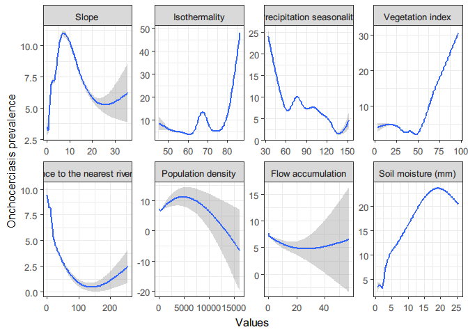

### Plotting the spatial field

-   Thank to this
    [blog](https://ourcodingclub.github.io/tutorials/inla/)

``` r
points.em <- mesh1$loc

stepsize <- 0.008 # This is given in coordinates unit (in this case this corresponds to 1km)
east.range <- diff(range(points.em[,1]))  # calculate the length of the longitude
north.range <- diff(range(points.em[,2])) # calculate the length of the latitude

nxy <- round(c(east.range, north.range)/stepsize)  # Calculate the number of cells in the x and y ranges

# Project the spatial field on the mesh vertices using the inla.mesh.projector() function
projgrid <- inla.mesh.projector(mesh1,
                                xlim = range(points.em[,1]),
                                ylim = range(points.em[,2]),
                                dims = nxy)
xmean <- inla.mesh.project(projgrid,
                           res$summary.random$spatial.field$mean)
xsd <- inla.mesh.project(projgrid,
                         res$summary.random$spatial.field$sd)

xmean2 <- t(xmean)
xmean3 <- xmean2[rev(1:length(xmean2[,1])),]
xmean_ras <- raster(xmean3,
                    xmn = range(projgrid$x)[1], xmx = range(projgrid$x)[2],
                    ymn = range(projgrid$y)[1], ymx = range(projgrid$y)[2],
                    crs = CRS("+proj=longlat +datum=WGS84 +no_defs"))

xsd2 <- t(xsd)
xsd3 <- xsd2[rev(1:length(xsd2[,1])),]
xsd_ras <- raster(xsd3,
                  xmn = range(projgrid$x)[1], xmx =range(projgrid$x)[2],
                  ymn = range(projgrid$y)[1], ymx =range(projgrid$y)[2],
                  crs = CRS("+proj=longlat +datum=WGS84 +no_defs"))
xmean_ras2 <- mask(xmean_ras, m)
xsd_ras2 <- mask(xsd_ras, m)
```

``` r
my.palette.var <- brewer.pal(n = 9, name = "BuPu")
my.palette.heat <- rev(brewer.pal(n = 9, name = "RdYlBu"))

p_mean <- tm_shape(xmean_ras2) + 
  tm_raster(title="Spatial field (Mean)", alpha = 1, palette = my.palette.heat, legend.is.portrait = T, style = "cont", midpoint = NA)+
  tm_shape(m)+
  tm_borders(lty = 1, lwd = 2, col = "black", alpha = .9) +
  tm_compass(type = "arrow", position = c(.1, .75)) +
  # tm_scale_bar(breaks = c(0, 100, 200, 400), text.size = .8, position = c(.6, .1)) +
  tm_layout(legend.outside = FALSE, legend.position = c(.61, .65), frame = FALSE, fontfamily = "Arial")


p_var <- tm_shape(xsd_ras2) + 
  tm_raster(title="Spatial field (SD)", alpha = 1, palette = my.palette.var, legend.is.portrait = T, style = "cont", midpoint = NA)+
  tm_shape(m)+
  tm_borders(lty = 1, lwd = 2, col = "black", alpha = .9) +
  # tm_compass(type = "arrow", position = c(.1, .75)) +
  tm_scale_bar(breaks = c(0, 100, 200, 400), text.size = .8, position = c(.6, .12)) +
  tm_layout(legend.outside = FALSE, legend.position = c(.61, .65), frame = FALSE, fontfamily = "Arial")

spatial_field <- tmap_arrange(p_mean, p_var, ncol = 2, widths = c(1,1), heights = 1)

spatial_field
```

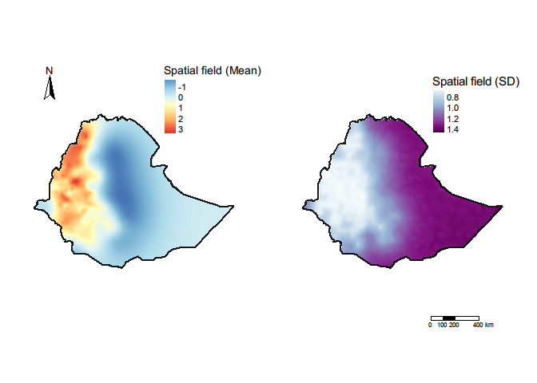

### Plotting observed and the predicted values from the model

``` r
data$PREV <- data$CASES/data$N  *100
pred_stack <- stack(r_prev_mean, r_prev_ll, r_prev_ul)
names(pred_stack) <- c("predicted_mean_prev", "pred_LL_prev", "pred_UL_prev")
pred_eth <- raster::extract(pred_stack, eth_prev2[c("LONG","LAT")], na.rm = TRUE, df = TRUE)


data2 <- as.data.frame(cbind(data, pred_eth)) 
data2$predicted_mean_prev <- data2$predicted_mean_prev *100
cor(data$PREV, pred_eth$predicted_mean_prev, method = "spearman")
```

    ## [1] 0.7147994

``` r
data2 <- data2 %>% dplyr::select(PREV, predicted_mean_prev, pred_LL_prev,
                                                         pred_UL_prev) %>% mutate(abs_difference = (abs(PREV-predicted_mean_prev)))
```

``` r
mypalette <- colorRampPalette(rev(brewer.pal(11, "Spectral")))

p <-ggplot(data2) +
  geom_point(mapping = aes(PREV , predicted_mean_prev, col = abs_difference)) +
  geom_abline(slope=1, intercept=0, linetype = "dashed") +
  ggpubr::stat_cor(mapping = aes(PREV, predicted_mean_prev), data = data2, method = "spearman", label.x = 50, label.y = 5) +
  scale_color_gradientn(colours = mypalette(100)) + 
  theme_bw(base_family = "Arial", base_size = 12) +
  xlab("Observed prevalence(%)") +
  ylab("Predicted prevalence (%)") + labs(color = "Absolute error") +
  theme(legend.position = "bottom", legend.key.size = unit(1, 'cm'),                                                                       #change legend key size
        legend.key.height = unit(.5, 'cm'), #change legend key height
        legend.key.width = unit(1, 'cm')) #+ facet_wrap(~variables)
p
```

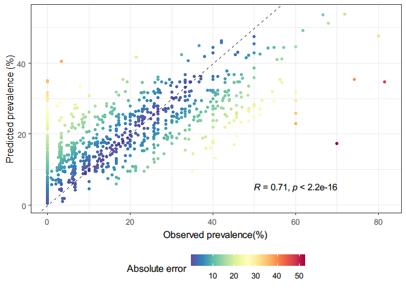

## Running the regular binomial model

``` r
res <- inla(predterms,
            family = "binomial", Ntrials = numtrials,
            data = inla.stack.data(datastack, spde = spde),
            control.family = list(link = "logit"),
            control.compute = list(dic = TRUE, waic = TRUE,
                                   cpo = TRUE, config = TRUE,
                                   openmp.strategy="huge"),
            control.predictor = list(
              compute = TRUE, link = 1,
              A = inla.stack.A(datastack)
            )
)
```

``` r
res <- readRDS("data/inla_point_res_5km_mesh5_binomial.rds")
```

``` r
# Mapping prediction ------------------------------------------------------
index <- inla.stack.index(stack = datastack, tag = "pred")$data

prev_mean <- res$summary.fitted.values[index, "mean"]
prev_ll <- res$summary.fitted.values[index, "0.025quant"]
prev_ul <- res$summary.fitted.values[index, "0.975quant"]
prev_sd <-  res$summary.fitted.values[index, "sd"]

summary(res$summary.fitted.values[index,])
```

    ##       mean                sd             0.025quant          0.5quant       
    ##  Min.   :0.003831   Min.   :0.004982   Min.   :0.000000   Min.   :0.000043  
    ##  1st Qu.:0.023867   1st Qu.:0.026593   1st Qu.:0.001975   1st Qu.:0.015084  
    ##  Median :0.036952   Median :0.039888   Median :0.003547   Median :0.023201  
    ##  Mean   :0.066737   Mean   :0.052196   Mean   :0.015298   Mean   :0.052146  
    ##  3rd Qu.:0.068380   3rd Qu.:0.063983   3rd Qu.:0.007998   3rd Qu.:0.047781  
    ##  Max.   :0.711758   Max.   :0.258180   Max.   :0.539374   Max.   :0.718327  
    ##    0.975quant           mode         
    ##  Min.   :0.01720   Min.   :0.000000  
    ##  1st Qu.:0.09397   1st Qu.:0.005245  
    ##  Median :0.14766   Median :0.009534  
    ##  Mean   :0.20427   Mean   :0.032479  
    ##  3rd Qu.:0.25470   3rd Qu.:0.021339  
    ##  Max.   :0.94822   Max.   :0.747998

``` r
load("data/220508_INLA_model_run_5km_binom.RData")
```

``` r
r_prev_mean <- raster_prev(prev_mean = prev_mean)
r_prev_ul <- raster_prev(prev_ul)
r_prev_ll <- raster_prev(prev_ll)
r_prev_sd <- raster_prev(prev_sd)
```

-   Mean prevalence

``` r
pal <- hcl.colors(100, palette = "Reds", rev =TRUE)

p_mean <- tm_shape(r_prev_mean*100) + 
  tm_raster(title="Binomial: Mean Prevalence (%)", alpha = 1, palette = pal, legend.is.portrait = F, style = "cont", midpoint = 50) +
  tm_shape(m)+
  tm_borders(lty = 1, lwd = 2, col = "black", alpha = .9) +
  tm_compass(type = "arrow", position = c("left", "top")) +
  tm_scale_bar(breaks = c(0, 100, 200, 400), text.size = .8, position = c("right", "bottom")) +
  tm_layout(legend.outside = FALSE, legend.position = c("right", "top"), frame = FALSE, fontfamily = "Arial")
p_mean
```

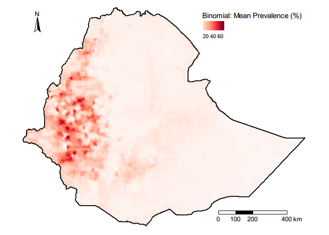

-   Prevalence upper limit

``` r
p_UL <- tm_shape(r_prev_ul*100) + 
  tm_raster(title="Binomial: Prevalence (%), UL", alpha = 1, palette = pal, legend.is.portrait = T, style = "cont", midpoint = 50) +
  tm_shape(m)+
  tm_borders(lty = 1, lwd = 2, col = "black", alpha = .9) +
  tm_compass(type = "arrow", position = c("left", "top")) +
  tm_scale_bar(breaks = c(0, 100, 200, 400), text.size = .8, position = c("right", "bottom")) +
  tm_layout(legend.outside = FALSE, legend.position = c("right", "top"), frame = FALSE, fontfamily = "Arial")
p_UL
```

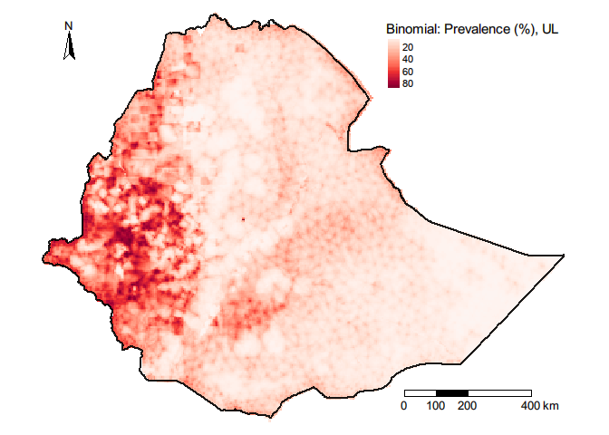

-   Prevalence lower limit

``` r
p_LL <- tm_shape(r_prev_ll*100) + 
  tm_raster(title="Binomial: Prevalence (%), LL", alpha = 1, palette = pal, legend.is.portrait = T, style = "cont", midpoint = 50) +
  tm_shape(m)+
  tm_borders(lty = 1, lwd = 2, col = "black", alpha = .9) +
  tm_compass(type = "arrow", position = c("left", "top")) +
  tm_scale_bar(breaks = c(0, 100, 200, 400), text.size = .8, position = c("right", "bottom")) +
  tm_layout(legend.outside = FALSE, legend.position = c("right", "top"), frame = FALSE, fontfamily = "Arial")
p_LL
```

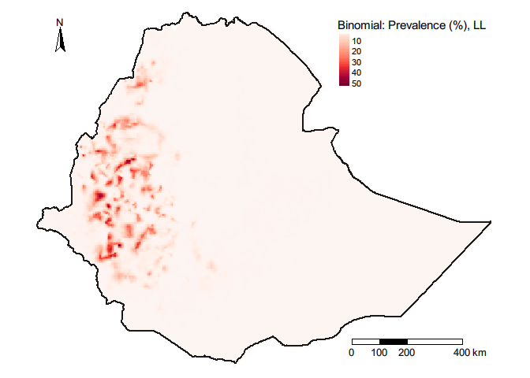

-   Prevalence uncertainty

``` r
pal <- hcl.colors(100, palette = "Blues", rev =TRUE)
p <- tm_shape(r_prev_sd*100) + 
  tm_raster(title="Prevalence(SD)", alpha = .8, palette = pal, legend.is.portrait = T, style = "cont") +
  tm_shape(m_0)+
  tm_borders(lty = 1, lwd = 2, col = "black", alpha = .9) +
  tm_shape(data_sf) + 
  tm_symbols(col = "black", shape = 3, alpha = .5, size = .07, legend.shape.show = T) +
  tm_compass(type = "arrow", position = c("left", "top")) +
  tm_scale_bar(breaks = c(0, 100, 200, 400), text.size = .8, position = c("right", "bottom")) +
  tm_layout(legend.outside = FALSE, legend.position = c("right", "top"), frame = FALSE, fontfamily = "Arial")
p
```

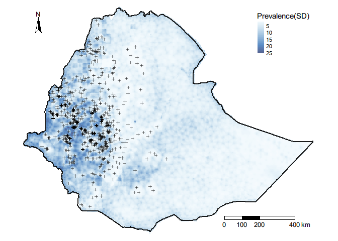

``` r
# Mapping exceedance probabilities ----------------------------------------

index <- inla.stack.index(stack = datastack, tag = "pred")$data
marg <- res$marginals.fitted.values[index][[1]]
1 - inla.pmarginal(q = 0.20, marginal = marg)

## P(Prevalence>20%)
excprob_20 <- sapply(res$marginals.fitted.values[index],
                  FUN = function(marg){1-inla.pmarginal(q = 0.20, marginal = marg)})
```

``` r
pal <- hcl.colors(100, palette = "RdYlBu", rev =TRUE)

excprob_20_map <- tm_shape(raster_excprob_20) + 
  tm_raster(title="P (nodule prevalence > 20%)", alpha = 1, palette = pal, legend.is.portrait = T, style = "cont", midpoint = 0.5) +
  tm_shape(m)+
  tm_borders(lty = 1, lwd = 2, col = "black", alpha = .9) +
  tm_compass(type = "arrow", position = c("left", "top")) +
  tm_scale_bar(breaks = c(0, 100, 200, 400), text.size = .8, position = c("right", "bottom")) +
  tm_layout(legend.outside = FALSE, legend.position = c("right", "top"), frame = FALSE, fontfamily = "Arial")
excprob_20_map
```

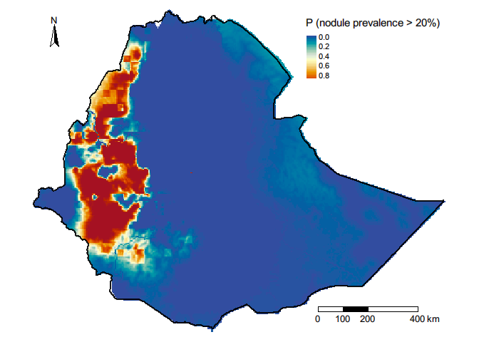
